# Maestro — OCI Manager Design Document

> *"The man in black fled across the desert, and the gunslinger followed."*
> -- Stephen King, The Gunslinger

**Version:** 1.0.0
**Date:** 2026-01-01
**Status:** Approved

All internal components of Maestro are named after the mythology of Stephen King's *The Dark Tower* series. See the [naming map](./dark-tower-naming-map.md) for detailed justifications. A quick-reference glossary is included in Appendix B.

---

## Table of Contents

1. [Executive Summary](#1-executive-summary)
2. [Architecture Overview](#2-architecture-overview)
3. [Component Design](#3-component-design)
4. [Data Models](#4-data-models)
5. [Project Structure](#5-project-structure)
6. [Technology Stack](#6-technology-stack)
7. [Security Model](#7-security-model)
8. [API Design](#8-api-design)
9. [Implementation Roadmap](#9-implementation-roadmap)
10. [Open Questions & Decisions](#10-open-questions--decisions)
11. [Appendix A: References](#appendix-a-references)
12. [Appendix B: Dark Tower Naming Glossary](#appendix-b-dark-tower-naming-glossary)

---

## 1. Executive Summary

### 1.1 Vision

**Maestro** is a modern, opinionated OCI manager CLI built in Go. It provides a unified interface for managing container images, running containers, configuring networks, and controlling storage — all with a rootless-first, daemonless architecture.

The internal architecture draws its naming from Stephen King's *The Dark Tower*: the **Tower** is the core engine, **Beams** are the network connections, **Ka** is the state machine that turns the wheel of container lifecycles, and **Gan** creates new containers. These aren't cosmetic labels — each mapping reflects a genuine structural parallel that helps developers navigate the codebase intuitively.

Maestro aims to be the tool developers reach for when they want Docker-level UX with Podman-level security, plus native OCI v1.1 artifact support that no existing tool does well out of the box.

### 1.2 Goals

| Goal | Description |
|------|-------------|
| **Rootless by default** | All operations run without root. Rootful mode is opt-in — the Calla governs itself |
| **Daemonless** | No long-running daemon process. Each CLI invocation is self-contained |
| **OCI v1.1 native** | First-class support for artifacts, referrers API, and supply chain security |
| **Pluggable runtimes** | Support runc, crun, youki, gVisor, and Kata via the Eld interface |
| **Developer UX** | Rich TUI (the Glass), intelligent defaults, Docker-compatible command surface |
| **Library-first** | Core logic implemented as Go libraries; the CLI (Dinh) is a thin wrapper |

### 1.3 Non-Goals

| Non-Goal | Rationale |
|----------|-----------|
| Kubernetes CRI implementation | CRI-O and containerd already excel here. Maestro targets developer workstations and CI/CD |
| Swarm/orchestration | Out of scope. Compose-like multi-container support may come later |
| Image building engine | Buildah and BuildKit are mature. Maestro delegates builds to them |
| Windows/macOS native containers | Maestro targets Linux containers. Cross-platform support via VM is Phase 3 |

### 1.4 Target Users

- **Developers** wanting a secure, fast, local container environment
- **CI/CD pipelines** needing rootless container operations
- **Security-conscious teams** requiring supply chain verification (signing, SBOM, attestations)
- **Platform engineers** managing OCI artifacts (Helm charts, Wasm modules, policies) in registries

### 1.5 Differentiators from Existing Tools

| Feature | Docker | Podman | nerdctl | **Maestro** |
|---------|--------|--------|---------|-------------|
| Daemonless | No | Yes | No (needs containerd) | **Yes** |
| Rootless default | No (opt-in) | Yes | Partial | **Yes (Calla mode)** |
| OCI v1.1 artifacts native | No | Partial | Partial | **First-class (Rose)** |
| Supply chain (sign/verify/SBOM) | External tools | External tools | cosign flag | **Built-in (Eld Mark)** |
| TUI dashboard | No | No | No | **Yes (Glass)** |
| Runtime pluggability | Limited | Yes | Yes (via containerd) | **Yes (Eld interface)** |
| Registry as artifact store | No | No | No | **Yes (Rose + ORAS)** |

---

## 2. Architecture Overview

### 2.1 High-Level Architecture — The Tower and its Beams

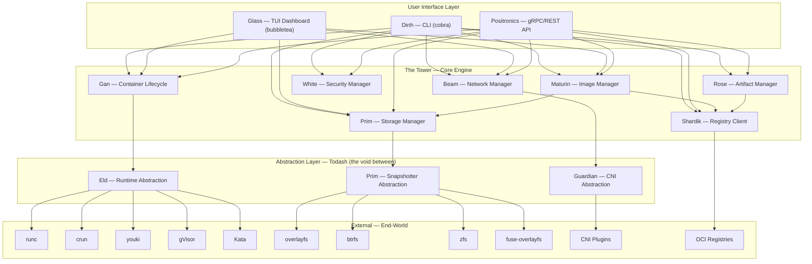

### 2.2 Daemon vs Daemonless Decision

**Decision: Daemonless with optional Positronics socket mode.**

> *"The Calla governs itself, without the authority of Gilead's gunslingers."*

#### Justification Based on Rootless Support

The daemonless architecture is the correct choice for Maestro. The analysis:

**Why daemonless wins for rootless:**

| Aspect | Daemon (containerd model) | Daemonless (Maestro model) |
|--------|--------------------------|--------------------------|
| **User namespace ownership** | Daemon runs in its own user namespace; must proxy operations for each user | Each CLI invocation runs in the invoking user's namespace. Natural 1:1 mapping |
| **subuid/subgid handling** | Daemon needs access to ALL users' subordinate ID ranges | Each process reads only its own user's `/etc/subuid` and `/etc/subgid` |
| **XDG compliance** | Daemon must manage `$XDG_RUNTIME_DIR` per-user | Natural per-user state at `~/.local/share/maestro/` |
| **Systemd integration** | Requires system-level service + per-user socket activation | Per-user systemd units via `maestro generate systemd` |
| **Privilege escalation surface** | Daemon is a persistent attack target. CVE-2019-5736 showed daemon amplification | No persistent process to attack. Each invocation is ephemeral |
| **cgroup delegation** | Daemon must be in a cgroup that can delegate to rootless containers | User's own cgroup tree is used directly |
| **Network namespace** | Daemon creates namespaces centrally; rootless requires pasta/slirp4netns per-user | CLI spawns pasta/slirp4netns directly in the user's context |
| **File ownership** | All container storage owned by daemon user | Storage naturally owned by the invoking user |
| **Crash isolation** | Daemon crash affects ALL containers on the host | No single point of failure |

**Key insight:** A daemon running as root must **deliberately drop privileges**. A daemon running as a user must **solve multi-tenancy within a single process**. The daemonless model sidesteps both: each invocation is already in the right security context.

**Positronics — Optional socket mode for advanced use cases:**

Some operations benefit from a persistent process:

- **Ka-shume (event streaming)** — `maestro events --follow`
- **Breaker (background GC)** — periodic cleanup without user intervention
- **Container monitoring** — health checks, restart policies
- **Positronics API server** — for IDE integrations, remote access

```bash
# Daemonless (default) - each command is self-contained
maestro run nginx:latest

# Positronics mode (opt-in) - starts lightweight API server
maestro service start
maestro --host unix:///run/user/1000/maestro.sock ps

# Systemd integration
maestro generate systemd --user > ~/.config/systemd/user/maestro.service
systemctl --user enable --now maestro
```

The Positronics process:

- Runs as the invoking user (never root)
- Stores state in `$XDG_RUNTIME_DIR/maestro/`
- Uses Khef (flock-based locking) to coordinate with concurrent CLI invocations
- Can be stopped/restarted without affecting running containers (containers are supervised by Cort, not Positronics)

#### Container Supervision — Cort (conmon-rs)

Running containers need a supervisor process that outlives the CLI invocation. Following Podman's proven approach, Maestro uses **Cort** (conmon-rs):

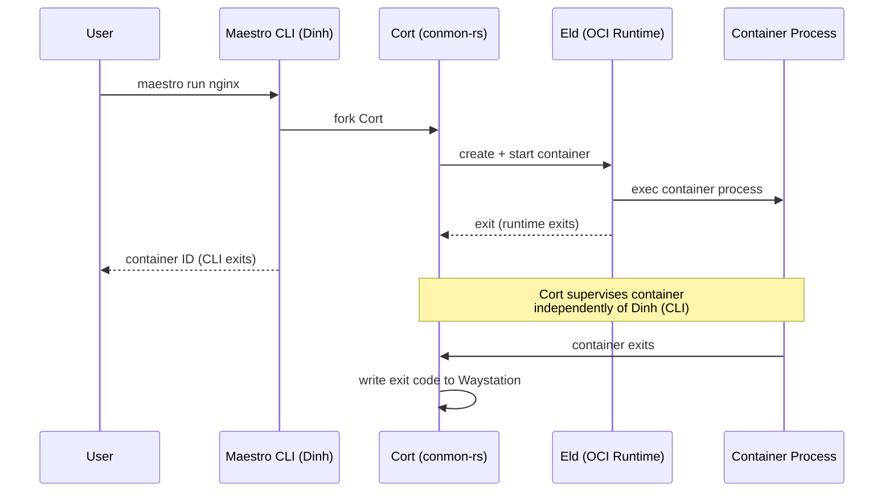

**Cort** (conmon-rs — the weapons master who watches over his charges):

- Lightweight (~2MB RSS per container)
- Handles stdio forwarding, logging, and exit code collection
- Independent of the CLI process lifecycle
- Source: [github.com/containers/conmon-rs](https://github.com/containers/conmon-rs)

### 2.3 State Management — The Waystation

> *"The Way Station is a simple, durable structure in the desert that holds what travelers need."*

Without a daemon, state is managed via the filesystem with Khef (file-based locking):

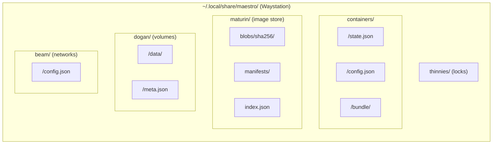

**Khef — Locking strategy:**

- Per-resource `flock()` locks (container, image, volume, network)
- Lock files in `thinnies/<resource-type>/<id>.lock`
- Read locks for inspection, write locks for mutations
- Lock timeout: 30 seconds (configurable)
- Dead lock detection via PID file inside lock

> *"We share Khef"* — concurrent processes are in harmony and do not corrupt shared state.

---

## 3. Component Design

### 3.1 Maturin — Image Manager

> *"See the TURTLE of enormous girth! On his shell he holds the earth."*

Maturin carries all the blobs that constitute every image in the system — the foundational substrate.

#### Library Foundation

Built on `github.com/google/go-containerregistry` (v0.21.2) for registry operations and `github.com/opencontainers/image-spec` (v1.1.1) for type definitions.

#### Drawing — Image Pull Flow

> *"Roland draws companions from other worlds through magical doorways on the beach."*

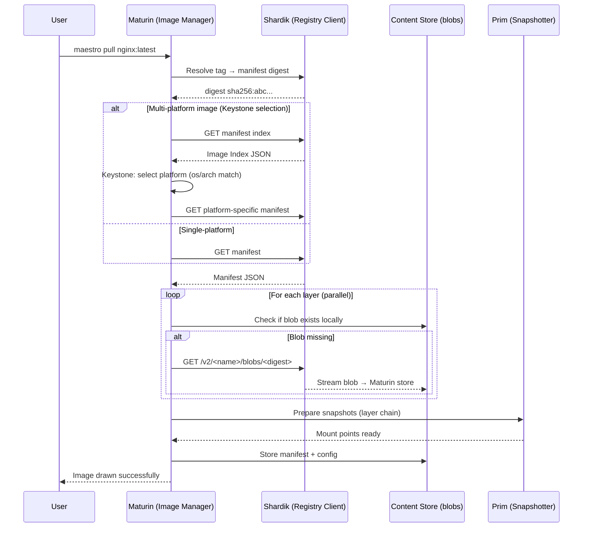

#### Content-Addressable Store (Maturin's Shell)

```
~/.local/share/maestro/maturin/
├── blobs/
│   └── sha256/
│       ├── abc123...  (manifest)
│       ├── def456...  (config)
│       ├── 789fed...  (layer tar.gz)
│       └── ...
├── manifests/
│   └── docker.io/
│       └── library/
│           └── nginx/
│               ├── latest → sha256:abc123...  (symlink)
│               └── 1.25   → sha256:xyz789...  (symlink)
└── index.json  (local OCI image index)
```

**Deduplication:** Layers are stored by content digest. Identical content produces identical digests — if `nginx:latest` and `nginx:1.25` share 3 of 4 layers, those 3 are stored once.

**Reap — Cache eviction (Charyou tree, "come reap"):**

1. **LRU by last-access time** — track `atime` or custom metadata
2. **Reference counting** — each manifest references layers; unreferenced blobs eligible for reaping
3. **Max storage limit** — configurable via `katet.toml` (`storage.max_size = "50GB"`)
4. **Manual reap** — `maestro image prune` removes dangling images; `maestro system prune` reaps all unused

#### Keystone — Multi-Platform Selection

> *"Among all the parallel worlds, the Keystone World is the one that matters most — the real one."*

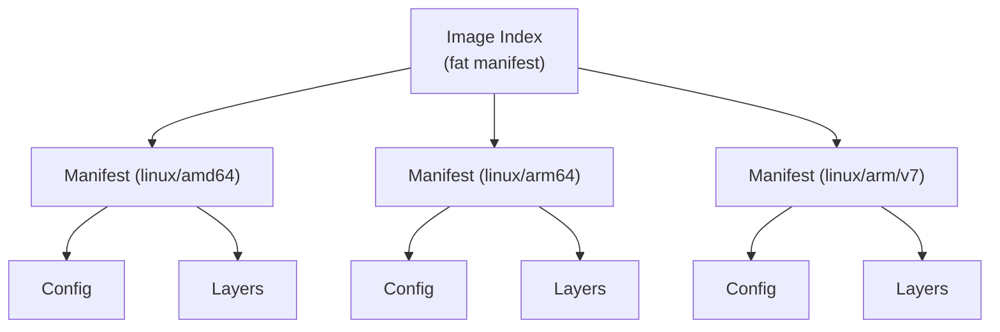

Keystone selection algorithm:

1. Exact match: `os` + `architecture` + `variant`
2. Fallback: `os` + `architecture` (ignore variant)
3. Error: no compatible Keystone found

Override: `maestro pull --platform linux/arm64 nginx:latest`

### 3.2 Gan — Container Lifecycle Manager

> *"Gan is the Prime Creator. He spoke the world into being."*

#### Ka — State Machine

> *"Ka is a wheel; its only purpose is to turn."*

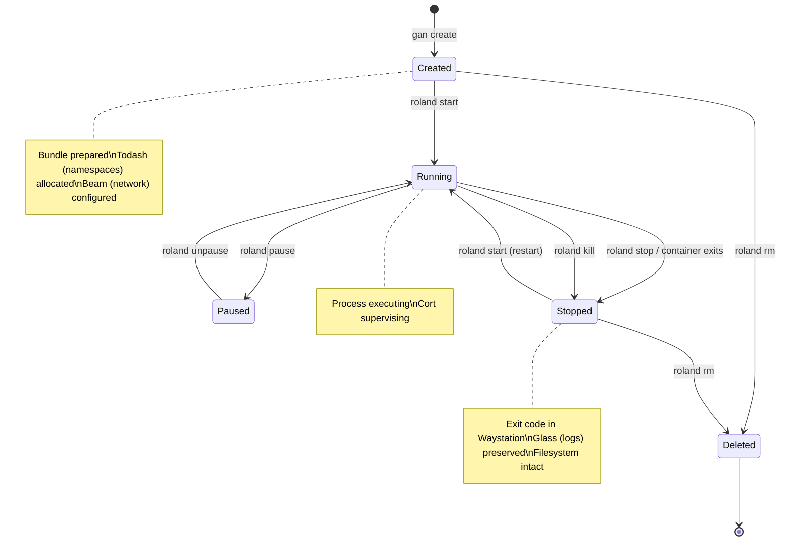

States are persisted in `containers/<id>/state.json` within the Waystation and updated atomically via write-to-temp + rename.

#### Container Create/Start Flow — Drawing of the Ka-tet

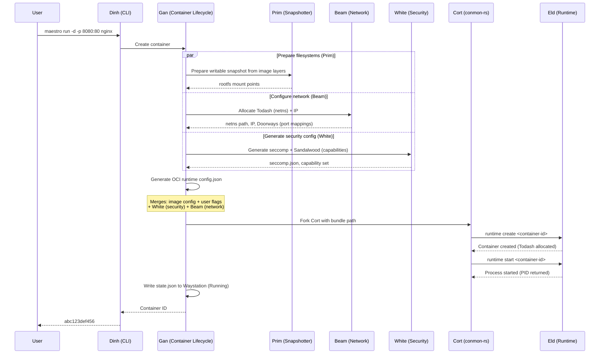

#### Eld — Runtime Abstraction Layer

> *"Arthur Eld is the common ancestor from whom all gunslingers descend."*

```go
// Eld defines the interface for OCI-compatible container runtimes.
// All runtimes descend from the same lineage — different gunslingers, same code.
type Eld interface {
    // Create creates a container from an OCI bundle (Gan's act of creation).
    Create(ctx context.Context, id string, bundle string, opts *CreateOpts) error
    // Start starts a previously created container (Roland draws).
    Start(ctx context.Context, id string) error
    // Kill sends a signal to the container's init process (Roland fires).
    Kill(ctx context.Context, id string, signal syscall.Signal) error
    // Delete removes the container (the wheel of Ka turns).
    Delete(ctx context.Context, id string, opts *DeleteOpts) error
    // State returns the container's current Ka (state).
    State(ctx context.Context, id string) (*specs.State, error)
    // Features returns the runtime's supported features.
    Features(ctx context.Context) (*Features, error)
}
```

**Pathfinder — Runtime discovery:**

1. Explicit config: `runtime.path = "/usr/bin/crun"` in `katet.toml`
2. `$PATH` lookup: `crun` -> `runc` -> `youki` (preference order)
3. Error if no gunslinger found

**Runtime selection per-container:**

```bash
maestro run --runtime crun nginx         # Fast startup (crun's speed)
maestro run --runtime runsc nginx        # gVisor sandbox (Todash isolation)
maestro run --runtime kata nginx         # VM isolation (End-World boundary)
```

#### Hook System

Maestro supports OCI lifecycle hooks plus custom maestro hooks:

| Hook | When | Use Case |
|------|------|----------|
| `createRuntime` | After Todash (namespaces) created, before pivot_root | GPU setup, device injection |
| `createContainer` | After createRuntime | Beam (network) pre-configuration |
| `startContainer` | After pivot_root, before user process | In-container ldconfig, cert injection |
| `poststart` | After user process started | Service mesh sidecar notification |
| `poststop` | After container stopped | Log shipping, cleanup |
| `maestro.prerun` | Before create (maestro-specific) | Eld Mark (image verification), policy check |
| `maestro.postrun` | After container fully removed | Audit logging |

### 3.3 Beam — Network Manager

> *"The Beams are the connective infrastructure of all reality. Without them, the Tower falls."*

#### Architecture

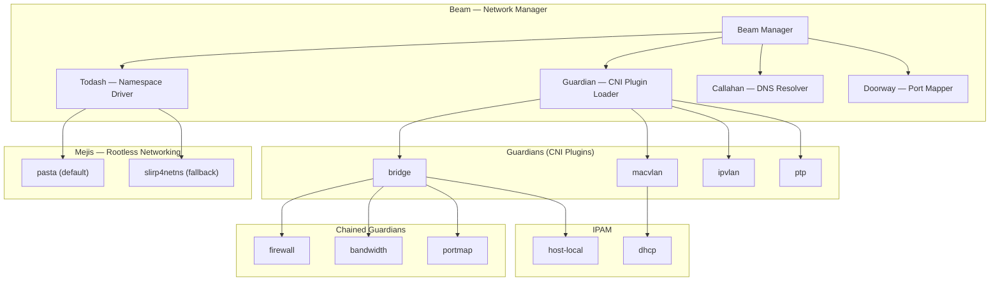

#### Todash — Network Namespace Lifecycle

> *"Todash space is the void between worlds. Creating a netns is like opening Todash: you carve out a void and populate it."*

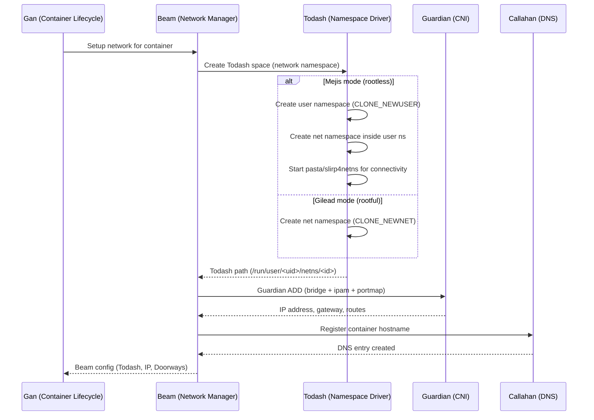

#### Trestle — Default Bridge Network

> *"The bridge at River Crossing — the default path that travelers use."*

Maestro creates a default bridge network called **beam0** on first use:

```json
{
  "cniVersion": "1.1.0",
  "name": "beam0",
  "plugins": [
    {
      "type": "bridge",
      "bridge": "beam0",
      "isGateway": true,
      "ipMasq": true,
      "hairpinMode": true,
      "ipam": {
        "type": "host-local",
        "ranges": [
          [{"subnet": "10.99.0.0/16"}]
        ],
        "routes": [
          {"dst": "0.0.0.0/0"}
        ]
      }
    },
    {
      "type": "firewall",
      "backend": "nftables"
    },
    {
      "type": "portmap",
      "capabilities": {"portMappings": true},
      "backend": "nftables"
    }
  ]
}
```

#### Doorway — Port Mapping

> *"Each Doorway connects a specific point in one world to a specific point in another."*

| Mode | Mechanism | Privileged Ports (<1024) | Performance |
|------|-----------|--------------------------|-------------|
| Gilead (rootful) | nftables DNAT via Guardian portmap | Yes | Native |
| Mejis (rootless/pasta) | pasta port forwarding | No (unless `sysctl net.ipv4.ip_unprivileged_port_start=0`) | Near-native |
| Mejis (rootless/slirp4netns) | Userspace TCP/IP stack | No | ~50% overhead |

#### Callahan — DNS Integration

> *"Pere Callahan knows everyone in the Calla by name."*

Callahan is a lightweight embedded DNS resolver (inspired by Aardvark-dns) per network:

- Resolves container names and aliases within the same Beam (network)
- Forwards external queries to host DNS servers
- Listens on `127.0.0.53` inside each container's Todash (netns)
- Supports cross-Beam resolution when containers are connected to multiple networks

#### IPv4/IPv6 Dual-Stack

```bash
maestro network create --ipv6 --subnet 10.100.0.0/16 --ipv6-subnet fd00:dead:beef::/48 my-beam
```

Both stacks are configured simultaneously through the Guardian bridge plugin's dual-range support.

### 3.4 Prim — Storage Manager

> *"The Prim is the primordial magical chaos from which all of reality was shaped."*

#### Snapshotter Abstraction

```go
// Prim abstracts filesystem operations for image layers and container rootfs.
// Different drivers shape the Prim differently, but the interface is the same.
type Prim interface {
    // Prepare creates a writable snapshot (Gan shapes new reality from Prim).
    Prepare(ctx context.Context, key, parent string) ([]Mount, error)
    // View creates a read-only snapshot (peer into an existing layer).
    View(ctx context.Context, key, parent string) ([]Mount, error)
    // Commit seals a writable snapshot into an immutable layer.
    Commit(ctx context.Context, name, key string) error
    // Remove returns the snapshot to the Prim.
    Remove(ctx context.Context, key string) error
    // Walk traverses All-World (all snapshots).
    Walk(ctx context.Context, fn func(Info) error) error
    // Usage returns disk usage for a snapshot.
    Usage(ctx context.Context, key string) (Usage, error)
}
```

#### Snapshotter Auto-Selection

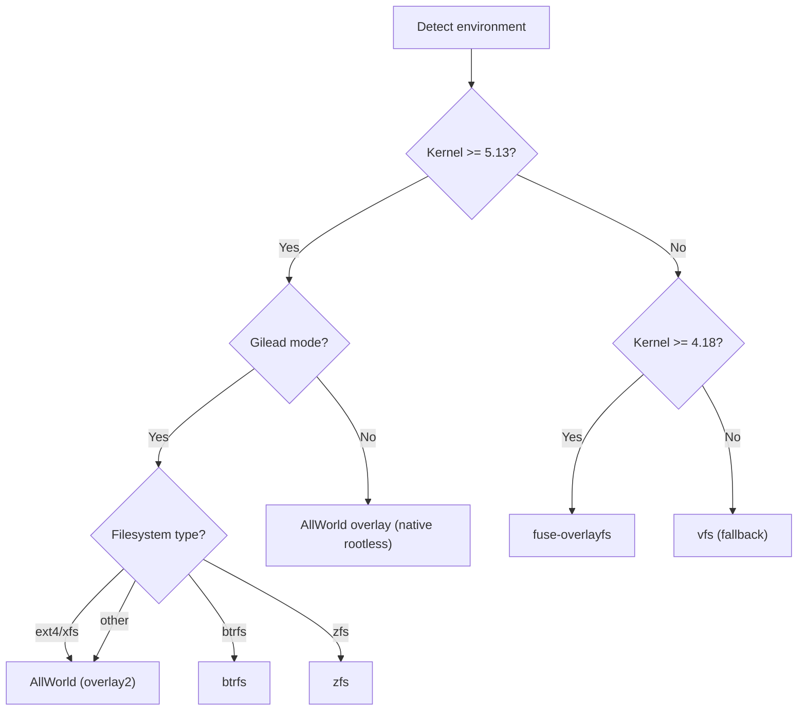

Maestro auto-detects the best Prim driver at first run and persists the choice in `katet.toml`. Users can override: `storage.driver = "btrfs"`.

#### Dogan — Volume Management

> *"The Dogans are persistent storage facilities that outlast the civilization that created them."*

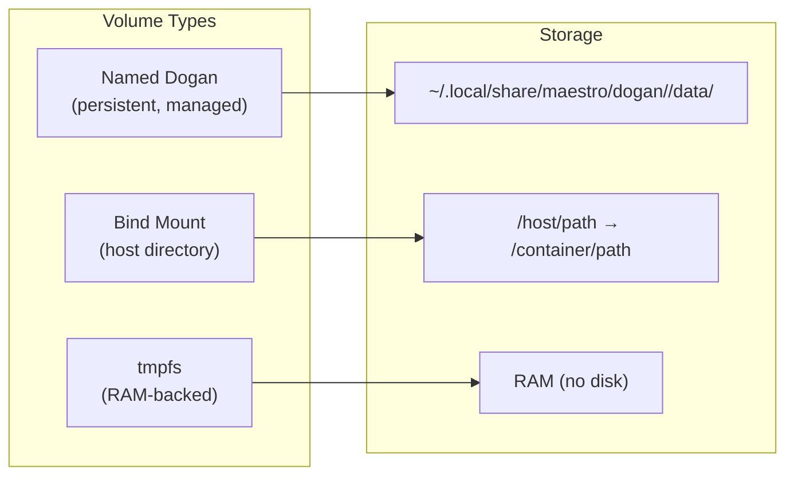

```bash
maestro volume create my-dogan                   # Create named volume
maestro run -v my-dogan:/app/data nginx          # Mount Dogan
maestro run -v /host/src:/app/src nginx          # Bind mount
maestro run --tmpfs /tmp:size=100m nginx         # tmpfs mount
maestro volume ls                                # List Dogans
maestro volume inspect my-dogan                  # Show details
maestro volume rm my-dogan                       # Remove Dogan
maestro volume prune                             # Reap unused Dogans
```

#### Reap — Cleanup and GC

> *"Charyou tree. Come reap."*

Two-phase garbage collection:

1. **Reference scan:** Walk all container configs -> collect referenced image digests and Dogan names
2. **Sweep (Reap):** Remove blobs not referenced by any manifest; remove snapshots not referenced by any container; optionally reap Dogans not mounted by any container

Reap is triggered:

- Manually: `maestro system prune`
- On threshold: when storage exceeds `storage.gc_threshold` (default: 80% of `storage.max_size`)
- By Breaker: if Positronics is active, every `storage.gc_interval` (default: 24h)

### 3.5 Shardik — Registry Client

> *"Shardik the Bear guards the boundary between worlds — the portal at his Beam's endpoint."*

#### OCI Distribution Spec Compliance

Built on `github.com/google/go-containerregistry` with full OCI Distribution Spec v1.1.0:

| Operation | Endpoint | Status |
|-----------|----------|--------|
| Pull manifest | `GET /v2/<name>/manifests/<ref>` | Required |
| Pull blob | `GET /v2/<name>/blobs/<digest>` | Required |
| Push manifest | `PUT /v2/<name>/manifests/<ref>` | Required |
| Monolithic blob upload | `POST + PUT` | Required |
| Chunked blob upload | `POST + PATCH + PUT` | Supported |
| Cross-repo mount | `POST ...?mount=<d>&from=<n>` | Supported |
| Tag listing | `GET /v2/<name>/tags/list` | Supported |
| **Referrers (Nineteen)** | `GET /v2/<name>/referrers/<digest>` | **Supported (v1.1)** |
| Delete manifest | `DELETE /v2/<name>/manifests/<ref>` | Supported |
| Delete blob | `DELETE /v2/<name>/blobs/<digest>` | Supported |

#### Sigul — Authentication Flow

> *"A sigul is proof of identity and authority. Roland's guns bear the sigul of Eld."*

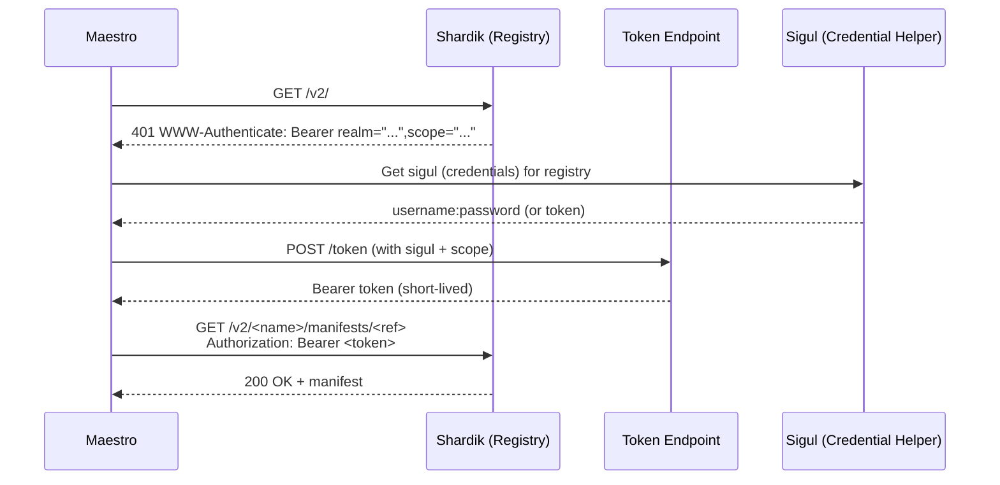

**Sigul resolution order:**

1. `--username`/`--password` CLI flags
2. `$MAESTRO_REGISTRY_TOKEN` environment variable
3. `~/.config/maestro/auth.json` (maestro-native)
4. `~/.docker/config.json` (Docker compatibility)
5. Credential helpers (`credHelpers` / `credsStore`)
6. Anonymous access

#### Thinny — Mirror/Proxy Support

> *"A thinny is a place where the barrier between parallel realities is thin — the same content accessible through a different point."*

```toml
# katet.toml
[[registry.mirrors]]
host = "docker.io"
endpoints = ["https://mirror.gcr.io", "https://registry-1.docker.io"]

[[registry.mirrors]]
host = "ghcr.io"
endpoints = ["https://ghcr.internal.company.com"]
skip_verify = true  # for internal registries with self-signed certs
```

#### Horn of Eld — Retry and Resilience

> *"Roland reaches the Tower, is sent back to the beginning, and tries again. Ka is a wheel."*

| Pattern | Implementation |
|---------|---------------|
| Retry (Horn of Eld) | Exponential backoff: 100ms -> 200ms -> 400ms -> ... (max 5 retries, max 30s) |
| Circuit breaker | Open after 3 consecutive failures; half-open after 60s — even Ka knows when to rest |
| Timeout | Connect: 10s, single blob: 5min, total pull: 30min |
| Resumable uploads | Chunked upload with `Range` header support |
| Parallel downloads | Up to 4 concurrent blob downloads per registry (configurable) |

### 3.6 Rose — Artifact Manager

> *"The Rose is not the Tower itself, but an artifact that represents and is connected to the Tower."*

The Rose leverages ORAS (`oras.land/oras-go/v2`) for non-container OCI artifact operations.

#### Supported Artifact Types

| Artifact | Media Type | Use Case |
|----------|-----------|----------|
| Helm chart | `application/vnd.cncf.helm.chart.content.v1.tar+gzip` | Package management |
| Wasm module | `application/vnd.wasm.content.layer.v1+wasm` | Edge/serverless |
| OPA policy | `application/vnd.opa.policy.layer.v1+rego` | Policy as code |
| Sigstore signature | `application/vnd.dev.sigstore.bundle.v0.3+json` | Image verification |
| SBOM (SPDX) | `application/spdx+json` | Supply chain |
| SBOM (CycloneDX) | `application/vnd.cyclonedx+json` | Supply chain |
| in-toto attestation | `application/vnd.in-toto+json` | Build provenance |

#### Operations

```bash
# Push artifact to registry
maestro artifact push registry.io/myrepo:v1 ./chart.tgz \
  --artifact-type application/vnd.cncf.helm.chart.content.v1.tar+gzip

# Attach Rose (artifact) to existing image (uses OCI subject/referrers)
maestro artifact attach registry.io/myapp:v1 ./sbom.spdx.json \
  --artifact-type application/spdx+json

# Nineteen — discover artifacts attached to an image (follow the signs)
maestro artifact ls registry.io/myapp:v1

# Pull specific artifact
maestro artifact pull registry.io/myrepo:v1 -o ./chart.tgz
```

### 3.7 Dinh — CLI Layer

> *"The dinh is the leader of a ka-tet — the root of command authority."*

#### Full Command Tree

```
maestro (Dinh — root command)
├── container (Gunslinger commands — immediate action)
│   ├── create      Gan creates a container without starting it
│   ├── start       Roland starts a stopped container
│   ├── stop        Roland stops a running container (SIGTERM → SIGKILL)
│   ├── restart     Roland restarts a container
│   ├── kill        Roland sends signal to container
│   ├── rm          Ka turns — remove a container
│   ├── ps          Survey Mid-World — list containers
│   ├── logs        Glass — view container logs
│   ├── exec        Touch — execute command in running container
│   ├── attach      Attach to container stdio
│   ├── inspect     Glass — show container details
│   ├── top         Display running processes
│   ├── stats       Live resource usage statistics
│   ├── port        List Doorways (port mappings)
│   ├── cp          Copy files between host and container
│   ├── diff        Palaver — show filesystem changes
│   ├── wait        Block until container stops
│   ├── pause       Pause container (cgroups freezer)
│   ├── unpause     Unpause container
│   ├── rename      Rename a container
│   └── prune       Reap stopped containers
│
├── image (Archivist commands — custodial operations)
│   ├── pull        Drawing — pull image from registry
│   ├── push        Unfound — push image to registry
│   ├── ls          List local images in Maturin
│   ├── rm          Remove image(s)
│   ├── inspect     Glass — show image details
│   ├── history     Show image layer history
│   ├── tag         Tag an image
│   ├── save        Export image to tar archive
│   ├── load        Import image from tar archive
│   ├── sign        Eld Mark — sign image with Sigstore/cosign
│   ├── verify      Verify Eld Mark (signature)
│   └── prune       Reap unused images
│
├── volume (Keeper commands — stewardship of Dogans)
│   ├── create      Create a Dogan (volume)
│   ├── ls          List Dogans
│   ├── inspect     Show Dogan details
│   ├── rm          Remove Dogan(s)
│   └── prune       Reap unused Dogans
│
├── network (Beamseeker commands — care of the Beams)
│   ├── create      Create a Beam (network)
│   ├── ls          List Beams
│   ├── inspect     Show Beam details
│   ├── rm          Remove Beam(s)
│   ├── connect     Connect container to Beam
│   ├── disconnect  Disconnect container from Beam
│   └── prune       Reap unused Beams
│
├── artifact (Collector commands — Maerlyn's Rainbow)
│   ├── push        Push Rose (artifact) to registry
│   ├── pull        Pull Rose from registry
│   ├── attach      Attach Rose to image (referrers)
│   ├── ls          Nineteen — list artifacts attached to image
│   └── inspect     Show Rose details
│
├── system (An-tet — full transparency and introspection)
│   ├── info        Show system information
│   ├── df          Show disk usage across Maturin/Dogan/Prim
│   ├── prune       Charyou tree — reap all unused resources
│   ├── events      Ka-shume — stream system events
│   └── check       Run system diagnostics
│
├── service (Positronics — persistent infrastructure)
│   ├── start       Start Positronics (socket mode API)
│   ├── stop        Stop Positronics
│   └── status      Show Positronics status
│
├── generate
│   ├── systemd     Generate systemd unit files
│   └── completion  Generate shell completions (bash/zsh/fish)
│
├── config
│   ├── show        Show current ka-tet configuration
│   └── edit        Open katet.toml in $EDITOR
│
├── run             (shortcut: gan create + roland start + attach)
├── exec            (shortcut: touch)
├── ps              (shortcut: survey Mid-World)
├── pull            (shortcut: drawing)
├── push            (shortcut: unfound)
├── images          (shortcut: archivist ls)
├── login           Present sigul to registry
├── logout          Remove sigul
├── version         Show version information
├── dashboard       Launch the Glass (TUI dashboard)
└── help            Help about any command
```

#### Global Flags

```
--config string          Ka-tet config path (default ~/.config/maestro/katet.toml)
--log-level string       Log level: debug, info, warn, error (default "warn")
--runtime string         Eld runtime: runc, crun, youki, runsc, kata (default "auto")
--storage-driver string  Prim driver: overlay, btrfs, zfs, vfs (default "auto")
--root string            Waystation root (default ~/.local/share/maestro)
--host string            Positronics socket URI
--format string          Output format: table, json, yaml (default "table")
--no-color               Disable colored output
--quiet, -q              Show only IDs
```

#### Output Formatting System

```bash
# Default table output (lipgloss-styled)
maestro ps
CONTAINER ID   IMAGE          STATUS      PORTS                   NAMES
abc123def456   nginx:latest   Running     0.0.0.0:8080->80/tcp    web-server

# JSON output for scripting
maestro ps --format json
[{"id":"abc123def456","image":"nginx:latest","status":"running",...}]

# Go template (Docker-compatible)
maestro ps --format '{{.ID}}\t{{.Image}}\t{{.Status}}'

# Quiet mode (IDs only, for piping)
maestro ps -q
abc123def456
```

#### Glass — TUI Dashboard

> *"Maerlyn's Rainbow lets the viewer see what is happening across multiple worlds simultaneously."*

```bash
maestro dashboard
```

Built with `bubbletea` v2 + `lipgloss` v2:

| Tab | Dark Tower Name | Content |
|-----|----------------|---------|
| Containers | Mid-World | Live list with status, CPU/memory, Doorways (ports) |
| Images | End-World | Local images with size, tags, layers |
| Volumes | Dogan | Dogan list with mount points, usage |
| Networks | Beams | Beam list with subnets, connected containers |
| Logs | Oracle | Aggregated container log stream |

Keyboard shortcuts: `Tab` switch panels, `Enter` inspect, `d` delete, `l` logs, `q` quit.

#### Ka-tet Configuration File

```toml
# ~/.config/maestro/katet.toml

[runtime]
default = "crun"                    # Preferred Eld runtime
path = ""                           # Custom runtime binary path (empty = Pathfinder)

[storage]
driver = "overlay"                  # Prim driver: overlay, btrfs, zfs, vfs
root = ""                           # Waystation root (empty = XDG default)
max_size = "50GB"                   # Max total storage
gc_threshold = 0.8                  # Reap triggers at 80% of max_size
gc_interval = "24h"                 # Breaker interval (Positronics mode)

[network]
default_driver = "bridge"           # Default Beam type
default_subnet = "10.99.0.0/16"    # Default Trestle (beam0) subnet
dns_enabled = true                  # Enable Callahan (embedded DNS)
cni_plugin_dirs = ["/opt/cni/bin", "/usr/lib/cni"]

[security]
rootless = true                     # Calla mode (default true)
default_seccomp = "builtin"         # White: "builtin", "unconfined", or path
default_apparmor = "maestro-default"
drop_all_caps = false               # If true, containers start with zero Sandalwood

[log]
driver = "json-file"                # json-file, journald, none
max_size = "10MB"
max_files = 3

[[registry.mirrors]]
host = "docker.io"
endpoints = ["https://registry-1.docker.io"]
```

---

## 4. Data Models

### 4.1 Container State Schema (Waystation)

```json
{
  "$schema": "maestro/container-state/v1",
  "id": "abc123def456789...",
  "name": "web-server",
  "image": {
    "name": "docker.io/library/nginx",
    "tag": "latest",
    "digest": "sha256:..."
  },
  "ka": {
    "status": "running",
    "pid": 12345,
    "started_at": "2026-03-27T10:00:00Z",
    "finished_at": null,
    "exit_code": null,
    "oom_killed": false
  },
  "config": {
    "hostname": "web-server",
    "domainname": "",
    "user": "1000:1000",
    "env": ["PATH=/usr/local/sbin:/usr/local/bin:/usr/sbin:/usr/bin:/sbin:/bin"],
    "cmd": ["nginx", "-g", "daemon off;"],
    "entrypoint": ["/docker-entrypoint.sh"],
    "working_dir": "/",
    "labels": {"app": "web"},
    "stop_signal": "SIGQUIT",
    "stop_timeout": 10
  },
  "dogan": [
    {
      "type": "volume",
      "source": "my-dogan",
      "destination": "/app/data",
      "options": ["rw"]
    }
  ],
  "beam": {
    "mode": "bridge",
    "networks": {
      "beam0": {
        "ip_address": "10.99.0.5",
        "gateway": "10.99.0.1",
        "mac_address": "02:42:0a:63:00:05"
      }
    },
    "doorways": [
      {"host_ip": "0.0.0.0", "host_port": 8080, "container_port": 80, "protocol": "tcp"}
    ]
  },
  "resources": {
    "memory_limit": 536870912,
    "cpu_shares": 1024,
    "cpu_quota": 0,
    "pids_limit": 4096
  },
  "white": {
    "seccomp_profile": "builtin",
    "apparmor_profile": "maestro-default",
    "sandalwood": {
      "add": [],
      "drop": ["ALL"]
    },
    "read_only_rootfs": false,
    "no_new_privileges": true
  },
  "eld": {
    "name": "crun",
    "path": "/usr/bin/crun"
  },
  "cort_pid": 12340,
  "glass_path": "/home/user/.local/share/maestro/containers/abc123.../container.log",
  "created_at": "2026-03-27T09:59:55Z"
}
```

### 4.2 Image Metadata Schema (Maturin)

```json
{
  "$schema": "maestro/image-metadata/v1",
  "digest": "sha256:abc123...",
  "media_type": "application/vnd.oci.image.manifest.v1+json",
  "repository": "docker.io/library/nginx",
  "tags": ["latest", "1.25"],
  "keystone": {
    "os": "linux",
    "architecture": "amd64"
  },
  "config": {
    "env": ["PATH=/usr/local/sbin:..."],
    "cmd": ["nginx", "-g", "daemon off;"],
    "exposed_ports": {"80/tcp": {}},
    "working_dir": "/",
    "labels": {},
    "author": ""
  },
  "layers": [
    {"digest": "sha256:...", "size": 31456789, "media_type": "application/vnd.oci.image.layer.v1.tar+gzip"}
  ],
  "total_size": 67890123,
  "created_at": "2026-03-15T12:00:00Z",
  "drawn_at": "2026-03-27T10:00:00Z",
  "last_used_at": "2026-03-27T10:00:00Z"
}
```

### 4.3 Beam (Network) Configuration Schema

```json
{
  "$schema": "maestro/beam/v1",
  "name": "my-beam",
  "id": "beam-abc123...",
  "driver": "bridge",
  "guardian_config": {
    "cniVersion": "1.1.0",
    "name": "my-beam",
    "plugins": [
      {
        "type": "bridge",
        "bridge": "maestro-br-abc1",
        "isGateway": true,
        "ipMasq": true,
        "ipam": {
          "type": "host-local",
          "ranges": [[{"subnet": "10.100.0.0/24", "gateway": "10.100.0.1"}]],
          "routes": [{"dst": "0.0.0.0/0"}]
        }
      }
    ]
  },
  "ipv6_enabled": false,
  "internal": false,
  "callahan_enabled": true,
  "labels": {},
  "created_at": "2026-03-27T09:00:00Z",
  "connected_containers": ["abc123...", "def456..."]
}
```

### 4.4 Dogan (Volume) Schema

```json
{
  "$schema": "maestro/dogan/v1",
  "name": "my-dogan",
  "driver": "local",
  "mountpoint": "/home/user/.local/share/maestro/dogan/my-dogan/data",
  "labels": {"app": "web"},
  "options": {},
  "created_at": "2026-03-27T08:00:00Z",
  "last_used_at": "2026-03-27T10:00:00Z",
  "used_by": ["abc123..."]
}
```

---

## 5. Project Structure

```
maestro/
├── cmd/
│   └── maestro/
│       └── main.go                    # Entry point — "Go then, there are other worlds than these"
│
├── internal/
│   ├── cli/                           # Dinh — CLI command definitions
│   │   ├── root.go                    # Dinh (root command + global flags)
│   │   ├── container.go               # Gunslinger commands (container subcommands)
│   │   ├── image.go                   # Archivist commands (image subcommands)
│   │   ├── volume.go                  # Keeper commands (volume subcommands)
│   │   ├── network.go                 # Beamseeker commands (network subcommands)
│   │   ├── artifact.go                # Collector commands (artifact subcommands)
│   │   ├── system.go                  # An-tet commands (system subcommands)
│   │   ├── service.go                 # Positronics commands (socket mode)
│   │   ├── generate.go                # generate subcommands
│   │   ├── shortcuts.go               # run, exec, ps, pull, push top-level
│   │   └── dashboard.go               # Glass launcher
│   │
│   ├── tower/                         # The Tower — Core engine
│   │   ├── tower.go                   # Tower struct, initialization
│   │   ├── container.go               # Container lifecycle orchestration
│   │   ├── image.go                   # Image operations orchestration
│   │   └── config.go                  # Ka-tet configuration loading
│   │
│   ├── gan/                           # Gan — Container lifecycle management
│   │   ├── gan.go                     # Container struct, Ka (state machine)
│   │   ├── create.go                  # Gan creates
│   │   ├── roland.go                  # Roland starts/stops/kills
│   │   ├── touch.go                   # Touch — container exec
│   │   └── glass.go                   # Glass — log streaming
│   │
│   ├── maturin/                       # Maturin — Image management
│   │   ├── store.go                   # Content-addressable store (the shell)
│   │   ├── drawing.go                 # Drawing — image pull
│   │   ├── unfound.go                 # Unfound — image push
│   │   ├── reap.go                    # Reap — garbage collection
│   │   └── keystone.go                # Keystone — multi-platform selection
│   │
│   ├── eld/                           # Eld — OCI runtime abstraction
│   │   ├── eld.go                     # Eld interface (all runtimes descend from Eld)
│   │   ├── oci.go                     # Generic OCI runtime implementation
│   │   ├── pathfinder.go              # Pathfinder — runtime auto-discovery
│   │   └── cort.go                    # Cort — conmon-rs integration
│   │
│   ├── beam/                          # Beam — Network management
│   │   ├── beam.go                    # Beam manager
│   │   ├── guardian.go                # Guardian — CNI plugin integration
│   │   ├── todash.go                  # Todash — network namespace lifecycle
│   │   ├── callahan.go                # Callahan — embedded DNS resolver
│   │   ├── doorway.go                 # Doorway — port mapping
│   │   └── mejis.go                   # Mejis — rootless networking (pasta/slirp4netns)
│   │
│   ├── prim/                          # Prim — Storage management
│   │   ├── prim.go                    # Prim interface (snapshotter abstraction)
│   │   ├── allworld.go                # AllWorld — OverlayFS snapshotter
│   │   ├── btrfs.go                   # Btrfs snapshotter
│   │   ├── zfs.go                     # ZFS snapshotter
│   │   ├── fuse.go                    # fuse-overlayfs snapshotter
│   │   ├── vfs.go                     # VFS snapshotter (fallback)
│   │   └── dogan.go                   # Dogan — volume management
│   │
│   ├── shardik/                       # Shardik — Registry client
│   │   ├── shardik.go                 # Shardik client
│   │   ├── sigul.go                   # Sigul — authentication
│   │   ├── thinny.go                  # Thinny — mirror/proxy resolution
│   │   └── horn.go                    # Horn of Eld — retry + circuit breaker
│   │
│   ├── rose/                          # Rose — OCI artifact management
│   │   ├── rose.go                    # Rose push/pull/attach
│   │   └── nineteen.go                # Nineteen — referrers API client
│   │
│   ├── white/                         # White — Security subsystem
│   │   ├── seccomp.go                 # Seccomp profile generation
│   │   ├── gunslinger.go              # AppArmor/SELinux — enforcers of the law
│   │   ├── sandalwood.go              # Sandalwood — capability management
│   │   ├── eldmark.go                 # Eld Mark — image signing (cosign)
│   │   └── calla.go                   # Calla — rootless setup (user namespaces)
│   │
│   ├── waystation/                    # Waystation — State management
│   │   ├── waystation.go              # File-based state store
│   │   ├── khef.go                    # Khef — flock-based locking
│   │   └── starkblast.go              # Starkblast — state schema migrations
│   │
│   ├── positronics/                   # Positronics — Optional socket mode
│   │   ├── positronics.go             # gRPC/REST API server
│   │   ├── kashume.go                 # Ka-shume — event streaming
│   │   └── breaker.go                 # Breaker — background GC worker
│   │
│   └── glass/                         # Glass — TUI dashboard
│       ├── glass.go                   # Main bubbletea app (Maerlyn's Rainbow)
│       ├── midworld.go                # Mid-World — container list view
│       ├── endworld.go                # End-World — image list view
│       ├── oracle.go                  # Oracle — log viewer
│       └── styles.go                  # lipgloss styles
│
├── pkg/                               # Public Go API (stable)
│   ├── types/                         # Shared type definitions
│   │   ├── container.go
│   │   ├── image.go
│   │   ├── network.go
│   │   └── volume.go
│   ├── client/                        # Client library for Positronics API
│   │   └── client.go
│   └── specgen/                       # OCI spec generator (runtime config.json builder)
│       └── specgen.go
│
├── configs/
│   ├── seccomp-default.json           # White — default seccomp profile
│   ├── cni-beam0.conflist             # Trestle — default bridge network config
│   └── katet.toml.example             # Example ka-tet configuration
│
├── scripts/
│   ├── install.sh
│   └── completions/
│
├── docs/
│   ├── design-document.md             # This file
│   ├── roadmap.md                     # Implementation roadmap (209 tasks)
│   ├── agent-protocol.md              # Agent development protocol
│   ├── operator-protocol.md           # Operator management protocol
│   ├── dark-tower-naming-map.md       # Complete naming reference
│   └── oci-ecosystem-research.md      # Research document
│
├── test/
│   ├── integration/
│   │   ├── gan_test.go                # Container lifecycle tests
│   │   ├── maturin_test.go            # Image management tests
│   │   ├── beam_test.go               # Network tests
│   │   └── dogan_test.go              # Volume tests
│   ├── e2e/
│   │   └── smoke_test.go
│   └── testutil/
│       ├── registry.go                # In-process test registry (mini-Shardik)
│       └── fixtures.go                # Test image fixtures
│
├── .github/
│   └── workflows/
│       ├── ci.yml
│       └── release.yml
│
├── go.mod
├── go.sum
├── Makefile
├── LICENSE                            # Apache 2.0
└── README.md
```

---

## 6. Technology Stack

### 6.1 Language and Version

**Go 1.26.2+** — Required for `slices`/`maps` packages, range over integers, enhanced `net/http` routing, and improved generics.

### 6.2 Key Dependencies

| Dependency | Version | Maestro Component | Rationale |
|-----------|---------|-------------------|-----------|
| `github.com/spf13/cobra` | v1.10.2 | Dinh (CLI) | Industry standard. Docker, Kubernetes, GitHub CLI use it |
| `github.com/google/go-containerregistry` | v0.21.2 | Shardik (Registry) | Immutable image interfaces, authn keychain, 1,559+ importers |
| `oras.land/oras-go/v2` | v2.x | Rose (Artifacts) | OCI v1.1 native, referrers support |
| `github.com/opencontainers/image-spec` | v1.1.1 | Maturin (Images) | Official Go types for OCI manifests |
| `github.com/opencontainers/runtime-spec` | v1.3.0 | Eld (Runtime) | Official Go types for runtime config.json |
| `github.com/containernetworking/cni` | v1.3.0 | Guardian (CNI) | CNI spec v1.1.0, GC and STATUS verbs |
| `github.com/containernetworking/plugins` | v1.9.1 | Guardian (CNI plugins) | bridge, macvlan, portmap, firewall, host-local |
| `github.com/vishvananda/netlink` | v1.x | Beam (Networking) | Netlink socket API |
| `github.com/charmbracelet/bubbletea` | v2.0.0 | Glass (TUI) | Elm Architecture, Cursed Renderer |
| `github.com/charmbracelet/lipgloss` | v2.0.0 | Glass (styles) | Declarative styling, table rendering |
| `github.com/pelletier/go-toml/v2` | v2.x | Ka-tet config | TOML parser for katet.toml |
| `github.com/rs/zerolog` | v1.x | Logging | Zero-allocation JSON logger |
| `google.golang.org/grpc` | v1.x | Positronics (API) | gRPC server for socket mode |

### 6.3 Build System

```makefile
VERSION    := $(shell git describe --tags --always --dirty)
COMMIT     := $(shell git rev-parse --short HEAD)
BUILD_DATE := $(shell date -u +%Y-%m-%dT%H:%M:%SZ)
LDFLAGS    := -X main.version=$(VERSION) -X main.commit=$(COMMIT) -X main.date=$(BUILD_DATE)

build:                    ## Build maestro binary
 go build -ldflags "$(LDFLAGS)" -o bin/maestro ./cmd/maestro

build-static:             ## Build static binary (for containers)
 CGO_ENABLED=0 go build -ldflags "$(LDFLAGS) -s -w" -o bin/maestro ./cmd/maestro

install:                  ## Install to $GOPATH/bin
 go install -ldflags "$(LDFLAGS)" ./cmd/maestro

test:                     ## Run unit tests
 go test -race -count=1 ./internal/... ./pkg/...

test-integration:         ## Run integration tests (requires Eld runtime)
 go test -race -count=1 -tags=integration ./test/integration/...

test-e2e:                 ## Run end-to-end tests
 go test -race -count=1 -tags=e2e ./test/e2e/...

lint:                     ## Run linters
 golangci-lint run ./...

fmt:                      ## Format code
 gofumpt -w .

clean:                    ## Reap build artifacts
 rm -rf bin/
```

### 6.4 Testing Strategy

| Level | Scope | Runner | Notes |
|-------|-------|--------|-------|
| **Unit** | Individual functions | `go test ./internal/...` | Mocked deps, fast, every commit |
| **Integration** | Subsystem interactions (Maturin pull, Gan create) | `go test -tags=integration` | Requires Eld runtime; uses in-process test registry |
| **E2E** | Full CLI workflows | `go test -tags=e2e` | Spawns real containers; requires Calla (rootless) setup |
| **Fuzz** | Input parsing (manifests, configs, CNI) | `go test -fuzz` | Go native fuzzing |

---

## 7. Security Model

### 7.1 Calla — Rootless by Default

> *"The Calla governs itself, without the authority of Gilead."*

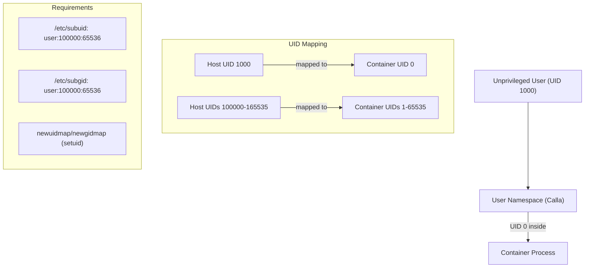

**First-run diagnostics:** `maestro system check` validates:

- subuid/subgid allocation
- Kernel version and features
- Available Eld runtimes (Pathfinder scan)
- Prim driver compatibility
- Mejis tools (pasta/slirp4netns)

### 7.2 Sigul — Credential Storage

| Method | Security Level | Use Case |
|--------|---------------|----------|
| OS keychain (via credential helpers) | High | Developer workstations |
| `$MAESTRO_REGISTRY_TOKEN` env var | Medium | CI/CD pipelines |
| `~/.config/maestro/auth.json` | Medium | Docker config compat |
| CLI flags `--username/--password` | Low | One-off operations |

`auth.json` permissions are enforced as `0600`. Maestro warns if permissions are too open.

### 7.3 Default Security Posture

| Control | Default | Maestro Name | Rationale |
|---------|---------|-------------|-----------|
| Rootless mode | **Enabled** | Calla | No privilege escalation risk |
| Seccomp | **Built-in profile** | White | Blocks ~44 dangerous syscalls |
| Capabilities | **Minimal set** | Sandalwood | CHOWN, DAC_OVERRIDE, FOWNER, FSETID, KILL, NET_BIND_SERVICE, SETGID, SETUID, SETFCAP, SETPCAP, SYS_CHROOT |
| `no_new_privileges` | **Enabled** | White | Prevents escalation via setuid |
| Read-only rootfs | Disabled (opt-in) | — | `--read-only` flag available |
| AppArmor | **Enabled** if available | Gunslinger | `maestro-default` profile |
| SELinux | **Enabled** if enforcing | Gunslinger | `container_t` label |

### 7.4 Eld Mark — Supply Chain Security Integration

> *"The Sign of Eld — the mark that proves an artifact's authenticity and lineage."*

```bash
# Sign an image after build
maestro image sign --key cosign.key registry.io/myapp:v1

# Keyless signing (CI/CD with OIDC)
maestro image sign --keyless registry.io/myapp:v1

# Verify Eld Mark before running
maestro run --verify-signature registry.io/myapp:v1

# Attach Rose (SBOM) to image
maestro artifact attach registry.io/myapp:v1 sbom.spdx.json \
  --artifact-type application/spdx+json

# Policy: require Eld Mark for all pulls
# katet.toml
[security.policy]
require_signature = true
trusted_keys = ["cosign.pub", "https://fulcio.sigstore.dev"]
```

---

## 8. API Design

### 8.1 Positronics — Socket Mode API

> *"North Central Positronics built persistent technological services that serve anyone who speaks their protocol."*

When running in socket mode (`maestro service start`), Positronics exposes a gRPC API:

```protobuf
syntax = "proto3";
package maestro.v1;

service GanService {  // Container Lifecycle
  rpc Create(CreateContainerRequest) returns (CreateContainerResponse);
  rpc Start(StartContainerRequest) returns (StartContainerResponse);
  rpc Stop(StopContainerRequest) returns (StopContainerResponse);
  rpc Kill(KillContainerRequest) returns (KillContainerResponse);
  rpc Remove(RemoveContainerRequest) returns (RemoveContainerResponse);
  rpc List(ListContainersRequest) returns (ListContainersResponse);
  rpc Inspect(InspectContainerRequest) returns (InspectContainerResponse);
  rpc Logs(LogsRequest) returns (stream LogEntry);           // Glass
  rpc Events(EventsRequest) returns (stream Event);          // Ka-shume
  rpc Stats(StatsRequest) returns (stream ContainerStats);
}

service MaturinService {  // Image Management
  rpc Pull(PullImageRequest) returns (stream PullProgress);    // Drawing
  rpc Push(PushImageRequest) returns (stream PushProgress);    // Unfound
  rpc List(ListImagesRequest) returns (ListImagesResponse);
  rpc Remove(RemoveImageRequest) returns (RemoveImageResponse);
  rpc Inspect(InspectImageRequest) returns (InspectImageResponse);
}

service BeamService {  // Network Management
  rpc Create(CreateNetworkRequest) returns (CreateNetworkResponse);
  rpc List(ListNetworksRequest) returns (ListNetworksResponse);
  rpc Remove(RemoveNetworkRequest) returns (RemoveNetworkResponse);
  rpc Connect(ConnectContainerRequest) returns (ConnectContainerResponse);
  rpc Disconnect(DisconnectContainerRequest) returns (DisconnectContainerResponse);
}

service DoganService {  // Volume Management
  rpc Create(CreateVolumeRequest) returns (CreateVolumeResponse);
  rpc List(ListVolumesRequest) returns (ListVolumesResponse);
  rpc Remove(RemoveVolumeRequest) returns (RemoveVolumeResponse);
  rpc Inspect(InspectVolumeRequest) returns (InspectVolumeResponse);
}

service TowerService {  // System
  rpc Info(InfoRequest) returns (InfoResponse);
  rpc DiskUsage(DiskUsageRequest) returns (DiskUsageResponse);
  rpc Prune(PruneRequest) returns (PruneResponse);          // Reap
  rpc Version(VersionRequest) returns (VersionResponse);
}
```

### 8.2 Transport

| Transport | Path | Use Case |
|-----------|------|----------|
| Unix socket | `$XDG_RUNTIME_DIR/maestro/positronics.sock` | Local access (default) |
| TCP | `localhost:9876` | Remote access (opt-in, TLS required) |
| REST gateway | grpc-gateway on same socket | For curl/HTTP clients |

### 8.3 API Versioning

- Package path: `maestro.v1`, `maestro.v2`
- Wire compatibility: additive changes within v1
- Breaking changes: new major version with deprecation period

---

## 9. Implementation Roadmap

### Phase 1 — MVP: "The Gunslinger" (Months 1-3)

**Goal:** Pull and run a container from Docker Hub, rootless, on a Linux machine.

| Milestone | Components | Acceptance Criteria |
|-----------|-----------|-------------------|
| **1.1 — The Tower rises** | Dinh (CLI), Ka-tet config, logging | `maestro version` and `maestro help` work. `katet.toml` parsed |
| **1.2 — Drawing of the Three** | Shardik (registry), Maturin (store), Sigul (auth) | `maestro pull nginx:latest` draws image into Maturin. Docker Hub auth works |
| **1.3 — Gan creates** | Eld (runtime), Gan (lifecycle), Cort (conmon-rs) | `maestro run --rm nginx echo hello` executes. Ka state persisted to Waystation |
| **1.4 — The Beam connects** | Beam (default bridge), Guardian (CNI), Doorway (ports) | `maestro run -p 8080:80 nginx` accessible at localhost:8080 |
| **1.5 — The Calla stands** | Calla (rootless), Mejis (rootless net), Prim auto-detect | All of the above works without root. `maestro system check` validates |

**MVP deliverable:** `maestro run -d -p 8080:80 nginx:latest` on a rootless Linux machine.

### Phase 2 — Core: "The Drawing of the Three" (Months 4-6)

| Milestone | Components | Acceptance Criteria |
|-----------|-----------|-------------------|
| **2.1 — Maturin grows** | Unfound (push), tag, save, load, inspect, Reap (GC) | Full image lifecycle. `maestro push` works |
| **2.2 — Roland's arsenal** | Touch (exec), Glass (logs), attach, cp, stats, pause | `maestro exec -it <ctr> bash` works. `maestro logs -f` streams |
| **2.3 — The Dogans persist** | Dogan (volumes), bind mounts, tmpfs, prune | `maestro volume create` + mount into container |
| **2.4 — Beams multiply** | Custom Beams, connect/disconnect, Callahan (DNS) | `maestro network create` + inter-container DNS resolution |
| **2.5 — Eld's lineage** | crun, youki, gVisor, Kata support | `maestro run --runtime runsc` launches gVisor container |
| **2.6 — Maerlyn's Rainbow** | Glass (TUI dashboard) with Mid-World, End-World, Oracle | `maestro dashboard` shows live system state |

### Phase 3 — Advanced: "The Dark Tower" (Months 7-12)

| Milestone | Components | Acceptance Criteria |
|-----------|-----------|-------------------|
| **3.1 — The Eld Mark** | Image signing (cosign), verification, SBOM attach | `maestro image sign` + `maestro run --verify-signature` |
| **3.2 — The Rose blooms** | Rose (artifacts), Nineteen (referrers) | `maestro artifact push` + `maestro artifact ls` |
| **3.3 — Positronics awakens** | gRPC server, Ka-shume (events), Breaker (GC) | `maestro service start` + API accessible |
| **3.4 — Systemd integration** | Unit file generation, Quadlet support | `maestro generate systemd` produces valid units |
| **3.5 — Lazy Drawing** | eStargz or Nydus snapshotter integration | `maestro pull --lazy` enables on-demand layer fetching |
| **3.6 — Other worlds** | VM for macOS/Windows (Podman Machine-style) | `maestro machine init` creates Linux VM |

---

## 10. Open Questions & Decisions

### 10.1 Key Architectural Decisions

| Decision | Options | Leaning | Trade-off |
|----------|---------|---------|-----------|
| **Cort implementation** | conmon-rs vs custom Go monitor | conmon-rs | Proven, but adds Rust build dep. Custom is simpler but less battle-tested |
| **Maturin storage** | go-containerregistry CAS vs containers/storage | go-containerregistry | containers/storage is more feature-complete but tightly coupled to Podman |
| **Callahan implementation** | Embedded Go DNS vs external (CoreDNS, Aardvark-dns) | Embedded Go (`miekg/dns`) | Avoids external dep. More code to maintain |
| **Guardian model** | Pure CNI vs Netavark-style monolithic | CNI + optimized defaults | CNI provides plugin ecosystem; perf gap is small |
| **Ka-tet config format** | TOML vs YAML | TOML | Simpler, no indentation issues |
| **Image build** | Delegate to buildah/buildkit vs integrate | Delegate | Building is solved. `maestro build` wraps `buildah bud` |

### 10.2 Trade-offs to Evaluate

| Trade-off | Pro | Con |
|-----------|-----|-----|
| **Library-first** | Enables reuse, testability | Slower to get initial UX feedback |
| **OCI-strict vs Docker-compat** | Cleaner, future-proof | Docker images still dominant |
| **go-containerregistry vs containers/image** | Cleaner API | containers/image has broader transport support |
| **Monorepo vs multi-repo** | Simpler development | Harder to version libs independently |

### 10.3 Risks

| Risk | Impact | Mitigation |
|------|--------|------------|
| Rootless kernel requirements vary | Users on older kernels can't use Calla mode | Auto-detection + clear errors + fallback to vfs/slirp4netns |
| CNI plugin compatibility | Beam setup failures | Integration tests against major Guardians |
| Cort (conmon-rs) version skew | Container supervision failures | Pin version, test against specific releases |
| OCI spec evolution | API changes | Abstract behind Eld/Maturin/Shardik interfaces |

---

## Appendix A: References

### Specifications

- [OCI Image Spec v1.1.1](https://github.com/opencontainers/image-spec)
- [OCI Distribution Spec v1.1.0](https://github.com/opencontainers/distribution-spec)
- [OCI Runtime Spec v1.3.0](https://github.com/opencontainers/runtime-spec)
- [CNI Spec v1.1.0](https://www.cni.dev/docs/spec/)

### Key Projects

- [containerd](https://github.com/containerd/containerd) — Container runtime daemon
- [Podman](https://github.com/containers/podman) — Daemonless container engine
- [runc](https://github.com/opencontainers/runc) — OCI reference runtime
- [crun](https://github.com/containers/crun) — Fast C runtime
- [conmon-rs](https://github.com/containers/conmon-rs) — Container monitor (Cort)
- [ORAS](https://github.com/oras-project/oras) — OCI artifact management
- [Sigstore/cosign](https://github.com/sigstore/cosign) — Container signing

### Go Libraries

- [go-containerregistry](https://github.com/google/go-containerregistry) — Shardik's foundation
- [cobra](https://github.com/spf13/cobra) — Dinh's framework
- [bubbletea](https://github.com/charmbracelet/bubbletea) — Glass engine
- [lipgloss](https://github.com/charmbracelet/lipgloss) — Glass styling

### Research

- See [oci-ecosystem-research.md](./oci-ecosystem-research.md) for full research document
- See [dark-tower-naming-map.md](./dark-tower-naming-map.md) for complete naming reference with justifications

### Protocols

- See [roadmap.md](./roadmap.md) for implementation roadmap
- See [agent-protocol.md](./agent-protocol.md) for agent development protocol
- See [operator-protocol.md](./operator-protocol.md) for operator management protocol

---

## Appendix B: Dark Tower Naming Glossary

Quick reference for navigating the codebase:

| Code Name | Component | Dark Tower Reference |
|-----------|-----------|---------------------|
| `tower` | Core engine | The Dark Tower — nexus of all realities |
| `maturin` | Image manager / content store | The Turtle who carries all worlds |
| `drawing` | Image pull | Drawing of the Three — pulling from other worlds |
| `unfound` | Image push | The Unfound Door — sending outward |
| `reap` | Garbage collection | Charyou tree — "come reap" |
| `keystone` | Multi-platform selection | Keystone World — the one true world |
| `gan` | Container lifecycle | The creator god |
| `roland` | Container start/stop/kill | The gunslinger's will over life and death |
| `touch` | Container exec | The Touch — reaching into another mind |
| `glass` | Logs / TUI dashboard | Wizard's Glass — seeing what happens elsewhere |
| `ka` | State machine | Ka is a wheel; its only purpose is to turn |
| `eld` | Runtime interface | Arthur Eld — ancestor of all gunslingers |
| `pathfinder` | Runtime discovery | Following the Path of the Beam |
| `cort` | conmon-rs (supervisor) | The weapons master who watches over trainees |
| `beam` | Network manager | The Beams hold everything together |
| `guardian` | CNI plugins | Guardians anchor the Beams |
| `todash` | Network namespaces | The void between worlds |
| `callahan` | DNS resolver | The priest who knows everyone's name |
| `doorway` | Port mapping | Portals connecting specific points between worlds |
| `mejis` | Rootless networking | Succeeding without Gilead's authority |
| `trestle` | Default bridge (beam0) | The bridge at River Crossing |
| `prim` | Snapshotter abstraction | The primordial substrate of creation |
| `allworld` | OverlayFS driver | Layered realities stacked on each other |
| `dogan` | Volume management | Persistent storage of the Old Ones |
| `palaver` | Layer diff/apply | Exchanging and reconciling knowledge |
| `shardik` | Registry client | The Guardian at the boundary |
| `sigul` | Authentication | The seal that proves identity |
| `thinny` | Mirror/proxy | A weak point where you can reach alternate paths |
| `horn` | Retry / circuit breaker | The Horn of Eld — second chances |
| `rose` | Artifact manager | The Tower's twin — artifact alongside the real thing |
| `nineteen` | Referrers API | The number that reveals hidden connections |
| `white` | Seccomp profiles | The force of order and protection |
| `gunslinger` | AppArmor/SELinux | Elite enforcers of the law |
| `sandalwood` | Capabilities | The guns — specific, granted powers |
| `eld_mark` | Image signing | The Sign of Eld — proof of authenticity |
| `calla` | Rootless setup | Self-governing without central authority |
| `waystation` | State store | The durable waypoint in the desert |
| `khef` | flock locking | Shared life-force that synchronizes the ka-tet |
| `starkblast` | State migrations | The storm that reshapes the landscape |
| `positronics` | API server (socket mode) | North Central Positronics — persistent services |
| `kashume` | Event streaming | The premonition that ka is turning |
| `breaker` | Background GC | Quietly eroding what is no longer needed |
| `dinh` | Root CLI command | The leader from whom all commands flow |
| `katet.toml` | Config file | The binding that defines the group |
| `beam0` | Default network | The first and default Beam |
| `thinnies/` | Lock directory | Where concurrent realities risk collision |

---

> *"Go then, there are other worlds than these."* — Jake Chambers

*Document generated as part of the Maestro project. Last updated: 2026-03-27.*
