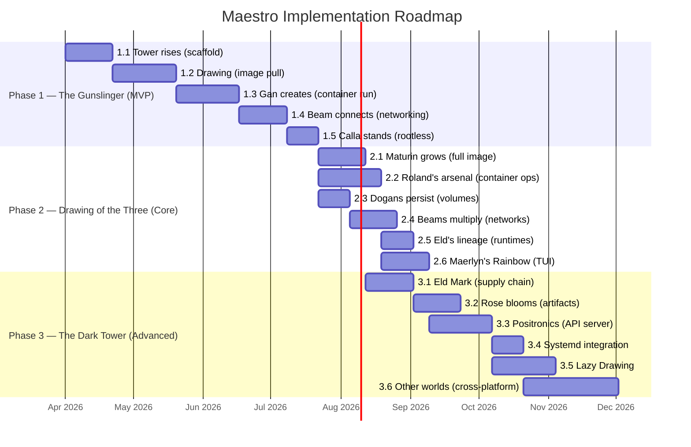
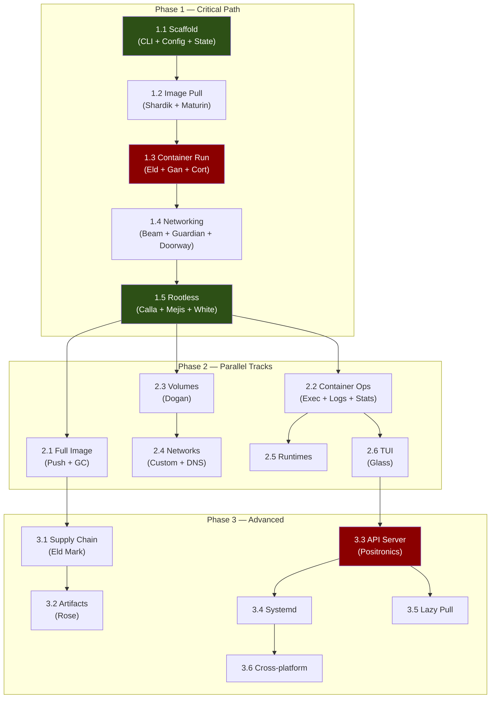

# Maestro — Implementation Roadmap

> *"First comes smiles, then lies. Last is gunfire."* — Roland Deschain

**Version:** 1.0.0
**Date:** 2026-03-29
**Status:** Planning
**Source:** [design-document.md](./design-document.md)

## Specification Coverage

All Phase 1 components have full behavioral specs. Phase 2-3 components have lightweight boundary specs. These specs are the behavioral contracts that drive implementation — every scenario maps to a Go test case.

| Component | Spec Domain | Requirements | Scenarios | Phase |
|-----------|-------------|:------------:|:---------:|:-----:|
| Waystation (state) | `waystation-state` | 20 | 90 | 1 |
| Dinh (CLI) | `dinh-cli` | 28 | 141 | 1 |
| Maturin (images) | `maturin-image` | 21 | 89 | 1 |
| Shardik (registry) | `shardik-registry` | 21 | 110 | 1 |
| Gan (containers) | `gan-lifecycle` | 49 | 170 | 1 |
| Eld (runtime) | `eld-runtime` | 29 | 109 | 1 |
| Beam (network) | `beam-network` | 17 | 91 | 1 |
| Prim (storage) | `prim-storage` | 21 | 93 | 1 |
| White (security) | `white-security` | 24 | 60 | 1 |
| Tower (engine) | `tower-engine` | 13 | 39 | 1 |
| Rose (artifacts) | `rose-artifact` | 6 | 8 | 3 |
| Positronics (API) | `positronics-api` | 6 | 10 | 3 |
| Glass (TUI) | `glass-tui` | 5 | 9 | 2 |
| **Total** | | **260** | **1,019** | |

Specs location: `openspec/specs/<domain>/spec.md`

This document details **every task** needed to implement the proposed design, organized into phases, milestones, epics, and individual tasks. Each task has a priority, dependencies, acceptance criteria, and a relative complexity estimate (1-5, where 5 is the most complex).

---

## Phase Overview

---

## Phase 1 — "The Gunslinger" (MVP)

**Goal:** `maestro run -d -p 8080:80 nginx:latest` works rootless on Linux.

---

### Milestone 1.1 — The Tower Rises (Project Scaffold)

> *The foundation of the Tower. Without it, no Beam can hold.*

#### Epic 1.1.1 — Project Infrastructure

| # | Task | Complexity | Deps | Acceptance Criteria |
|---|--------|:-----------:|------|-------------------|
| 1 | Update `go.mod` to Go 1.26.1+, add core dependencies (cobra, zerolog, go-toml) | 1 | — | `go build ./...` compiles without errors |
| 2 | Configure `golangci-lint` with strict rules (`.golangci.yml`) | 1 | — | `make lint` runs and passes on scaffold |
| 3 | Update `Makefile` with targets: build, build-static, install, test, test-integration, test-e2e, lint, fmt, clean, generate, completions | 2 | #1 | All targets execute (test targets may have 0 tests) |
| 4 | Create GitHub Actions CI workflow (`.github/workflows/ci.yml`): lint, test, build on Go 1.26.1, matrix linux/amd64+arm64 | 2 | #2, #3 | Push to main runs CI successfully |
| 5 | Create GitHub Actions release workflow (`.github/workflows/release.yml`): goreleaser with static binaries, checksums, automatic changelog | 2 | #4 | Tag `v0.0.1-alpha` generates release with binaries |
| 6 | Add `.goreleaser.yml` with builds for linux/amd64, linux/arm64 | 1 | #5 | goreleaser validates config |

#### Epic 1.1.2 — Dinh (CLI Foundation)

| # | Task | Complexity | Deps | Acceptance Criteria |
|---|--------|:-----------:|------|-------------------|
| 7 | Create `internal/cli/root.go` — root command with cobra: global flags (`--config`, `--log-level`, `--runtime`, `--storage-driver`, `--root`, `--host`, `--format`, `--no-color`, `--quiet`) | 2 | #1 | `maestro --help` displays all flags |
| 8 | Implement `maestro version` with ldflags (version, commit, date, Go version, OS/arch) | 1 | #7 | `maestro version` displays correct information |
| 9 | Implement `maestro help` with styled output (lipgloss) | 1 | #7 | Help renders with colors and formatting |
| 10 | Create stub commands for all subcommand groups: container, image, volume, network, artifact, system, service, generate, config | 2 | #7 | `maestro container --help` lists subcommands (stubs return "not implemented") |
| 11 | Implement shortcuts on root: `run`, `exec`, `ps`, `pull`, `push`, `images`, `login`, `logout` pointing to the actual subcommands | 1 | #10 | `maestro run --help` shows the same help as `maestro container run --help` |
| 12 | Implement output formatting system: `--format table/json/yaml`, Go templates (`--format '{{.ID}}'`), `--quiet` mode | 3 | #7 | `maestro version --format json` returns valid JSON |

#### Epic 1.1.3 — Ka-tet Configuration

| # | Task | Complexity | Deps | Acceptance Criteria |
|---|--------|:-----------:|------|-------------------|
| 13 | Create `configs/katet.toml.example` with all sections documented | 1 | — | File serves as reference |
| 14 | Implement `internal/tower/config.go` — `katet.toml` loader with defaults, env var overrides, merge with CLI flags | 3 | #1 | Config loads from `~/.config/maestro/katet.toml` with fallback to sensible defaults |
| 15 | Implement `maestro config show` and `maestro config edit` | 1 | #14 | `config show` displays effective config in TOML; `config edit` opens `$EDITOR` |
| 16 | Create first-run experience: detect absence of `katet.toml`, create with defaults, display welcome message | 2 | #14 | First run creates config and shows "Welcome to Maestro" |

#### Epic 1.1.4 — Waystation (State Store)

| # | Task | Complexity | Deps | Acceptance Criteria |
|---|--------|:-----------:|------|-------------------|
| 17 | Implement `internal/waystation/waystation.go` — file-based state store with atomic CRUD operations (write-to-temp + rename) | 3 | — | Unit tests prove write atomicity (crash safety) |
| 18 | Implement `internal/waystation/khef.go` — flock-based locking with read/write locks, configurable timeout, dead lock detection via PID | 3 | #17 | Two concurrent processes do not corrupt state; deadlock is detected in <30s |
| 19 | Create directory structure: `~/.local/share/maestro/{containers,maturin,dogan,beam,thinnies}` on first-run | 1 | #17 | Directories created with correct permissions (0700) |
| 20 | Implement `internal/waystation/starkblast.go` — schema versioning in state store with automatic migration | 2 | #17 | State v1 is automatically migrated to v2 on startup |

#### Epic 1.1.5 — Logging & Observability

| # | Task | Complexity | Deps | Acceptance Criteria |
|---|--------|:-----------:|------|-------------------|
| 21 | Implement zerolog structured logging with levels configurable via `--log-level` and `katet.toml` | 2 | #14 | `--log-level debug` shows detailed logs on stderr; default `warn` is silent |
| 22 | Implement formatted log output: human-readable for terminal, JSON for file/pipe | 1 | #21 | TTY receives colored output; pipe receives JSON |

**Milestone 1.1 acceptance criteria:** `maestro version`, `maestro help`, `maestro config show` work. CI passes. State store is atomic and thread-safe.

---

### Milestone 1.2 — Drawing of the Three (Image Pull)

> *"Roland draws companions from other worlds through magical doorways on the beach."*

#### Epic 1.2.1 — Shardik (Registry Client)

| # | Task | Complexity | Deps | Acceptance Criteria |
|---|--------|:-----------:|------|-------------------|
| 23 | Implement `internal/shardik/shardik.go` — wrapper over go-containerregistry for OCI Distribution Spec v1.1.0 registry operations | 3 | #1 | Client resolves tags and performs GET on manifests and blobs |
| 24 | Implement `internal/shardik/sigul.go` — credential resolution chain: CLI flags → env var → `auth.json` → `~/.docker/config.json` → credential helpers → anonymous | 3 | #23 | Login to Docker Hub, GCR, GHCR, and ECR works |
| 25 | Implement `maestro login` / `maestro logout` — interactive authentication with secure password prompt | 2 | #24 | `maestro login docker.io` saves credentials in `auth.json` with 0600 permissions |
| 26 | Implement `internal/shardik/horn.go` — retry with exponential backoff + circuit breaker (3 failures → open, 60s → half-open) | 2 | #23 | Retry works for network errors; circuit breaker opens after 3 consecutive failures |
| 27 | Implement `internal/shardik/thinny.go` — mirror/proxy resolution from `katet.toml` | 2 | #23, #14 | Pull from `docker.io` tries mirror first; fallback to primary |
| 28 | Implement content negotiation — Accept headers for OCI manifest + Docker manifest v2 + fat manifest | 1 | #23 | Pull accepts OCI and Docker format images |

#### Epic 1.2.2 — Maturin (Content-Addressable Store)

| # | Task | Complexity | Deps | Acceptance Criteria |
|---|--------|:-----------:|------|-------------------|
| 29 | Implement `internal/maturin/store.go` — CAS in `~/.local/share/maestro/maturin/blobs/sha256/` with operations: Put(digest, reader), Get(digest), Exists(digest), Delete(digest) | 3 | #17 | Blob stored and retrieved by digest; digest verified on read |
| 30 | Implement manifest store with symlinks for tags: `maturin/manifests/<registry>/<repo>/<tag> → sha256:<digest>` | 2 | #29 | Tag resolves to correct digest; multiple tags can point to the same manifest |
| 31 | Implement local `index.json` — OCI image index tracking all local images | 2 | #29 | Index is atomically updated on each pull/rm |
| 32 | Implement integrity verification — SHA256 of each blob is verified on write and read | 1 | #29 | Corrupted blob is detected and reported |

#### Epic 1.2.3 — Drawing (Pull Logic)

| # | Task | Complexity | Deps | Acceptance Criteria |
|---|--------|:-----------:|------|-------------------|
| 33 | Implement `internal/maturin/drawing.go` — full pull flow: resolve tag → get manifest → download layers (parallel, up to 4) → store in Maturin | 4 | #23, #29 | `maestro pull nginx:latest` downloads complete image |
| 34 | Implement Keystone selection (`internal/maturin/keystone.go`) — detect host OS/arch, select correct manifest from Image Index | 2 | #33 | On arm64, pull of multi-platform image selects arm64 manifest |
| 35 | Implement `--platform` flag for Keystone selection override | 1 | #34 | `maestro pull --platform linux/arm64 nginx` downloads arm64 variant even on amd64 |
| 36 | Implement progress bar for layer download — styled output with lipgloss showing per-layer + total progress | 2 | #33 | Pull displays real-time progress with speed and ETA |
| 37 | Implement layer deduplication — skip download if blob already exists in local CAS | 1 | #33 | Pull of image sharing layers with another already present downloads only new layers |
| 38 | Implement Docker manifest v2 compatibility — convert Docker manifest to OCI manifest on ingestion | 2 | #33 | Pull of Docker-format image works transparently |

#### Epic 1.2.4 — Image CLI Commands (Read Operations)

| # | Task | Complexity | Deps | Acceptance Criteria |
|---|--------|:-----------:|------|-------------------|
| 39 | Implement `maestro image ls` — list local images with REPOSITORY, TAG, IMAGE ID, CREATED, SIZE | 2 | #31, #12 | Formatted table output; `--format json` works; `--quiet` shows only IDs |
| 40 | Implement `maestro image inspect <image>` — display complete image metadata (config, layers, platform, labels) | 2 | #29 | Detailed JSON output with all OCI manifest + config information |
| 41 | Implement `maestro image history <image>` — display layer history with size and command that created each one | 2 | #29 | Shows each layer with CREATED BY, SIZE, and whether it is an empty layer |
| 42 | Implement `maestro image rm <image>` — remove local image (with dependent container check) | 2 | #29, #17 | Image removed; error if active container depends on it; `--force` removes anyway |

**Milestone 1.2 acceptance criteria:** `maestro pull nginx:latest` + `maestro images` + `maestro image inspect nginx` work. Auth with Docker Hub works. Multi-platform pull works.

---

### Milestone 1.3 — Gan Creates (Container Run)

> *"Gan is the Prime Creator. He spoke the world into being."*

#### Epic 1.3.1 — Eld (Runtime Abstraction)

| # | Task | Complexity | Deps | Acceptance Criteria |
|---|--------|:-----------:|------|-------------------|
| 43 | Define `internal/eld/eld.go` — Eld interface with Create, Start, Kill, Delete, State, Features | 2 | — | Interface compiles; clear documentation for each method |
| 44 | Implement `internal/eld/oci.go` — generic Eld implementation that executes any OCI runtime via CLI (runc/crun/youki) | 4 | #43 | Executes `runc create`, `runc start`, `runc kill`, `runc delete`, `runc state` |
| 45 | Implement `internal/eld/pathfinder.go` — runtime discovery: search `crun` → `runc` → `youki` in `$PATH`; config override via `katet.toml`; validate version and features | 2 | #43, #14 | Detects installed runtime; reports version; fails with clear message if none found |
| 46 | Implement `internal/eld/cort.go` — conmon-rs integration: fork, configure stdin/stdout/stderr pipes, PID file, exit code file | 4 | #43 | Cort (conmon-rs) is forked, monitors container, survives CLI exit |

#### Epic 1.3.2 — Prim (Snapshotter MVP)

| # | Task | Complexity | Deps | Acceptance Criteria |
|---|--------|:-----------:|------|-------------------|
| 47 | Define `internal/prim/prim.go` — Prim interface with Prepare, View, Commit, Remove, Walk, Usage | 2 | — | Interface compiles |
| 48 | Implement `internal/prim/allworld.go` — OverlayFS snapshotter: mount layers as lowerdir stack, create upperdir + workdir | 4 | #47 | Image layers mounted as overlay; container has functional writable layer |
| 49 | Implement `internal/prim/vfs.go` — VFS snapshotter (fallback): copy full filesystem per layer | 2 | #47 | Works on any filesystem; slow but correct |
| 50 | Implement Prim driver auto-detection — kernel version check, filesystem check, rootless check | 2 | #48, #49 | Selects overlay if kernel supports it; fallback to vfs |

#### Epic 1.3.3 — Gan (Container Lifecycle)

| # | Task | Complexity | Deps | Acceptance Criteria |
|---|--------|:-----------:|------|-------------------|
| 51 | Implement `internal/gan/create.go` — container creation: generate ID, prepare bundle dir, extract rootfs via Prim, generate `config.json` OCI Runtime Spec | 5 | #44, #48, #29 | Bundle dir created with mounted rootfs and valid config.json |
| 52 | Implement OCI Runtime Spec generator (`pkg/specgen/specgen.go`) — merge image config + user flags + defaults into valid `config.json` | 4 | — | Generates config.json that runc/crun accepts without errors |
| 53 | Implement `internal/gan/gan.go` — Ka state machine: Created → Running → Stopped → Deleted; atomic persistence in Waystation | 3 | #17, #51 | State is persisted and recovered correctly after restart |
| 54 | Implement `internal/gan/roland.go` — start: fork Cort (conmon-rs), Cort invokes Eld create+start; stop: SIGTERM with timeout, fallback SIGKILL; kill: direct signal | 4 | #46, #53 | Container starts, runs, and can be stopped/killed. Exit code is collected |
| 55 | Implement `maestro container create <image>` — CLI command that creates container without starting | 2 | #51 | Container appears in `maestro ps -a` with status Created |
| 56 | Implement `maestro container start <id>` — CLI command that starts a created container | 1 | #54 | Container transitions to Running |
| 57 | Implement `maestro container stop <id>` — SIGTERM + timeout (default 10s) + SIGKILL | 1 | #54 | Container stops gracefully; `--time 5` changes timeout |
| 58 | Implement `maestro container kill <id>` — send specific signal (`--signal SIGINT`) | 1 | #54 | Signal sent; default SIGKILL |
| 59 | Implement `maestro container rm <id>` — remove stopped container: cleanup rootfs, remove state, release resources | 2 | #53 | Container removed; error if running (except `--force`) |
| 60 | Implement `maestro container ps` — list containers with ID, IMAGE, COMMAND, CREATED, STATUS, PORTS, NAMES | 2 | #53, #12 | Lists running containers; `--all` shows all states |
| 61 | Implement `maestro run` — shortcut: create + start + attach (foreground) or create + start (background with `-d`) | 3 | #55, #56 | `maestro run --rm nginx echo hello` executes and cleans up. `maestro run -d nginx` runs in background |
| 62 | Implement container naming — `--name` flag, auto-generated random names (adjective_noun style), uniqueness check | 2 | #51 | `maestro run --name web nginx` works; duplicate name is rejected |
| 63 | Implement `maestro container inspect <id>` — full JSON dump of container state | 1 | #53, #12 | Complete JSON output with all schema fields |

#### Epic 1.3.4 — Container Logging MVP

| # | Task | Complexity | Deps | Acceptance Criteria |
|---|--------|:-----------:|------|-------------------|
| 64 | Implement json-file log driver — Cort writes stdout/stderr to `containers/<id>/container.log` with timestamps in JSON | 3 | #46 | Logs written during container execution |
| 65 | Implement `maestro container logs <id>` — display logs; `--follow` for streaming; `--tail N` for last N lines; `--timestamps` | 2 | #64 | `maestro logs -f <id>` streams logs in real-time |

**Milestone 1.3 acceptance criteria:** `maestro run --rm nginx:latest echo hello` executes and displays output. `maestro run -d --name web nginx` runs in background. `maestro ps` lists container. `maestro stop web` + `maestro rm web` clean up everything.

---

### Milestone 1.4 — The Beam Connects (Networking)

> *"The Beams hold everything together. Without them, the Tower falls."*

#### Epic 1.4.1 — Beam Core

| # | Task | Complexity | Deps | Acceptance Criteria |
|---|--------|:-----------:|------|-------------------|
| 66 | Implement `internal/beam/todash.go` — create/destroy network namespaces; bind mount at persistent path | 3 | — | Namespace created and accessible by path; cleanup removes bind mount |
| 67 | Implement `internal/beam/guardian.go` — CNI plugin loader: search plugins in configured dirs, invoke ADD/DEL/CHECK with correct env vars and stdin JSON | 4 | #66 | Bridge plugin is invoked correctly; IP allocated; interface created |
| 68 | Create `configs/cni-beam0.conflist` — default bridge network config with bridge + firewall + portmap plugins | 1 | — | Conflist is valid for CNI v1.1.0 |
| 69 | Implement `internal/beam/beam.go` — network manager: initialize beam0 on first-use, attach/detach containers from networks | 3 | #66, #67, #68 | Container receives IP from range 10.99.0.0/16 on start |

#### Epic 1.4.2 — Doorway (Port Mapping)

| # | Task | Complexity | Deps | Acceptance Criteria |
|---|--------|:-----------:|------|-------------------|
| 70 | Implement `internal/beam/doorway.go` — parse port specs (`-p 8080:80`, `-p 127.0.0.1:8080:80/tcp`, `-p 8080-8090:80-90`) | 2 | — | All Docker port spec formats are accepted |
| 71 | Integrate port mapping with CNI portmap plugin — pass capabilities to the plugin in the chain | 2 | #67, #70 | `maestro run -p 8080:80 nginx` is accessible at localhost:8080 |

#### Epic 1.4.3 — Gan + Beam Integration

| # | Task | Complexity | Deps | Acceptance Criteria |
|---|--------|:-----------:|------|-------------------|
| 72 | Integrate Beam into Gan create flow — create Todash (netns), invoke Guardian (CNI ADD), pass netns path to runtime config.json | 3 | #51, #69 | Created container has functional network with IP and gateway |
| 73 | Integrate Beam cleanup into Gan rm flow — invoke Guardian (CNI DEL), destroy Todash | 2 | #59, #69 | Container removal cleans up all network resources |
| 74 | Implement `maestro container port <id>` — list active port mappings | 1 | #70 | Displays `80/tcp -> 0.0.0.0:8080` |

**Milestone 1.4 acceptance criteria:** `maestro run -d -p 8080:80 nginx:latest` serves HTTP at localhost:8080. Container has an IP on the beam0 network. Cleanup removes all network rules.

---

### Milestone 1.5 — The Calla Stands (Rootless)

> *"The Calla governs itself, without the authority of Gilead."*

#### Epic 1.5.1 — Calla (Rootless Setup)

| # | Task | Complexity | Deps | Acceptance Criteria |
|---|--------|:-----------:|------|-------------------|
| 75 | Implement `internal/white/calla.go` — user namespace setup: read `/etc/subuid`+`/etc/subgid`, invoke `newuidmap`/`newgidmap`, map UID 0 inside container to host user | 4 | — | Container executes with UID 0 inside but UID 1000 on host |
| 76 | Implement `internal/prim/fuse.go` — fuse-overlayfs snapshotter for kernels < 5.13 | 3 | #47 | Overlay works without root on kernel 4.18+ |
| 77 | Update Prim auto-detection to consider rootless: kernel >= 5.13 → native overlay; 4.18-5.12 → fuse-overlayfs; < 4.18 → vfs | 1 | #50, #76 | Correct driver selected based on environment |

#### Epic 1.5.2 — Mejis (Rootless Networking)

| # | Task | Complexity | Deps | Acceptance Criteria |
|---|--------|:-----------:|------|-------------------|
| 78 | Implement `internal/beam/mejis.go` — integration with `pasta` (default) and `slirp4netns` (fallback) for rootless networking | 4 | #66 | Rootless containers have network connectivity |
| 79 | Implement rootless port mapping via pasta — forwarding without iptables | 2 | #78, #70 | `-p 8080:80` works rootless with pasta |
| 80 | Detect and report privileged port limitation (<1024) in rootless — clear error message suggesting `sysctl` workaround | 1 | #78 | `maestro run -p 80:80` in rootless shows informative error |

#### Epic 1.5.3 — System Check

| # | Task | Complexity | Deps | Acceptance Criteria |
|---|--------|:-----------:|------|-------------------|
| 81 | Implement `maestro system check` — full diagnostic: subuid/subgid, kernel version, Eld runtimes (Pathfinder), Prim compatibility, Mejis tools (pasta/slirp4netns), fuse device | 3 | #45, #77, #78 | Styled output shows checklist with checkmark/cross for each requirement; fix suggestions for missing items |
| 82 | Implement `maestro system info` — system information: OS, kernel, detected runtime, storage driver, network mode, rootless status, paths | 2 | #81 | Complete output in table and JSON |

#### Epic 1.5.4 — White (Security Defaults)

| # | Task | Complexity | Deps | Acceptance Criteria |
|---|--------|:-----------:|------|-------------------|
| 83 | Create `configs/seccomp-default.json` — default seccomp profile (based on shared Docker/Podman profile, ~44 blocked syscalls) | 2 | — | Profile is valid JSON accepted by runc/crun |
| 84 | Implement `internal/white/seccomp.go` — load and apply seccomp profile in OCI config.json | 2 | #52, #83 | Containers run with seccomp by default; `--security-opt seccomp=unconfined` disables |
| 85 | Implement `internal/white/sandalwood.go` — capability management: minimal default set, `--cap-add`, `--cap-drop` | 2 | #52 | Default drop of dangerous caps; `--cap-add NET_ADMIN` adds; `--cap-drop ALL` removes all |
| 86 | Enable `no_new_privileges` by default in OCI config.json | 1 | #52 | Flag present in all containers |
| 87 | Integrate all security defaults into specgen — seccomp, capabilities, no_new_privileges, masked paths, readonly paths | 2 | #84, #85, #86 | Default container has security posture equivalent to Podman |

**Milestone 1.5 acceptance criteria:** ALL of Milestone 1.1-1.4 works **without root**. `maestro system check` reports healthy environment. Security defaults applied.

**Phase 1 acceptance criteria:** `maestro run -d -p 8080:80 --name web nginx:latest` works rootless. `curl localhost:8080` returns the nginx default page. `maestro ps`, `maestro logs web`, `maestro stop web`, `maestro rm web` work.

---

## Phase 2 — "The Drawing of the Three" (Core)

**Goal:** Feature-complete for daily development use.

---

### Milestone 2.1 — Maturin Grows (Full Image Lifecycle)

#### Epic 2.1.1 — Unfound (Image Push)

| # | Task | Complexity | Deps | Acceptance Criteria |
|---|--------|:-----------:|------|-------------------|
| 88 | Implement `internal/maturin/unfound.go` — push flow: read local manifest → check blob existence on registry (HEAD) → upload missing blobs (parallel) → push manifest | 4 | #29, #23 | `maestro push localhost:5000/myapp:v1` pushes image to local registry |
| 89 | Implement chunked upload with resumable support for large blobs | 2 | #88 | Upload of layer > 100MB uses chunks; interruption allows resume |
| 90 | Implement cross-repo blob mount — mount blobs from another repo on the same registry without re-upload | 2 | #88 | Push detects blobs available in another repo and performs mount |

#### Epic 2.1.2 — Image Operations

| # | Task | Complexity | Deps | Acceptance Criteria |
|---|--------|:-----------:|------|-------------------|
| 91 | Implement `maestro image tag <source> <target>` — create new tag for existing image | 1 | #30 | Tag created as new symlink; both tags listed |
| 92 | Implement `maestro image save <image> -o file.tar` — export image to OCI tar archive | 2 | #29 | Tar contains valid OCI layout; importable by other tools |
| 93 | Implement `maestro image load -i file.tar` — import image from OCI or Docker tar archive | 3 | #29 | Imported image appears in `maestro images`; supports both formats |
| 94 | Implement `maestro image prune` — remove dangling images (without tag) | 2 | #42 | `--all` removes images without container; `--filter until=24h` by date |

#### Epic 2.1.3 — Reap (Garbage Collection)

| # | Task | Complexity | Deps | Acceptance Criteria |
|---|--------|:-----------:|------|-------------------|
| 95 | Implement `internal/maturin/reap.go` — blob GC: walk manifests → build reference set → delete unreferenced blobs | 3 | #29 | Orphan blobs are removed; referenced blobs are preserved |
| 96 | Implement `maestro system prune` — combined reap: stopped containers + dangling images + unused volumes + unused networks | 2 | #95, #94 | Reports freed space; `--all` is more aggressive; confirmation prompt |
| 97 | Implement storage threshold monitoring — warn when storage exceeds `gc_threshold` | 1 | #95, #14 | Warning displayed on pull/run operations when near limit |

---

### Milestone 2.2 — Roland's Arsenal (Container Operations)

#### Epic 2.2.1 — Touch (Container Exec)

| # | Task | Complexity | Deps | Acceptance Criteria |
|---|--------|:-----------:|------|-------------------|
| 98 | Implement `internal/gan/touch.go` — exec via `nsenter` or runtime exec: enter container namespaces, execute command | 4 | #44, #53 | `maestro exec <id> ls /` executes in the container and returns output |
| 99 | Implement TTY allocation for exec — `-it` mode with pseudo-terminal, resize handling, raw mode | 3 | #98 | `maestro exec -it <id> bash` opens a functional interactive shell |
| 100 | Implement env var injection in exec — `--env KEY=VALUE`, `--env-file` | 1 | #98 | Extra environment variables available in exec |
| 101 | Implement `--user` flag for exec — execute as different user inside the container | 1 | #98 | `maestro exec --user nobody <id> whoami` returns "nobody" |
| 102 | Implement `--workdir` flag for exec | 1 | #98 | Exec runs in the specified directory |

#### Epic 2.2.2 — Glass (Container Logs Enhancement)

| # | Task | Complexity | Deps | Acceptance Criteria |
|---|--------|:-----------:|------|-------------------|
| 103 | Implement log rotation — configurable `max_size` and `max_files` | 2 | #64 | Logs rotated when exceeding size; old files removed |
| 104 | Implement `--since` and `--until` to filter logs by timestamp | 2 | #65 | `maestro logs --since 5m <id>` shows only last 5 minutes |
| 105 | Implement journald log driver as alternative to json-file | 2 | #64 | `katet.toml: log.driver = "journald"` sends logs to systemd journal |

#### Epic 2.2.3 — Container Management

| # | Task | Complexity | Deps | Acceptance Criteria |
|---|--------|:-----------:|------|-------------------|
| 106 | Implement `maestro container attach <id>` — attach to stdin/stdout/stderr of the container main process | 3 | #46 | Attach works; Ctrl+P Ctrl+Q detach |
| 107 | Implement `maestro container cp <src> <dst>` — copy files host↔container (bidirectionally) | 3 | — | `maestro cp file.txt <id>:/tmp/` and `maestro cp <id>:/etc/hostname .` work |
| 108 | Implement `maestro container stats` — live streaming of CPU, memory, net I/O, block I/O via cgroups | 3 | #53 | Table output with real-time refresh; `--no-stream` for single snapshot |
| 109 | Implement `maestro container top <id>` — ps output of processes inside the container | 1 | #53 | Lists processes with PID, USER, TIME, COMMAND |
| 110 | Implement `maestro container pause/unpause` — freeze/thaw via cgroups freezer | 2 | #54 | Frozen container does not consume CPU; unpause restores |
| 111 | Implement `maestro container rename <old> <new>` | 1 | #53 | Name updated in Waystation |
| 112 | Implement `maestro container diff <id>` — Palaver: show filesystem changes (A/C/D) vs original image | 2 | #48 | Lists added, modified, and deleted files |
| 113 | Implement `maestro container wait <id>` — block until container stops, return exit code | 1 | #53 | Exit code returned as CLI exit status |
| 114 | Implement `maestro container restart <id>` — stop + start with configurable options | 1 | #57, #56 | `--time 5` changes stop timeout |
| 115 | Implement `maestro container prune` — Reap stopped containers | 1 | #59 | Removes stopped containers; `--filter` supported |

#### Epic 2.2.4 — Container Run Enhancements

| # | Task | Complexity | Deps | Acceptance Criteria |
|---|--------|:-----------:|------|-------------------|
| 116 | Implement `--env` and `--env-file` for `maestro run` | 1 | #52 | Environment variables passed to container |
| 117 | Implement `--user` for run — run as specific user | 1 | #52 | `maestro run --user 1000:1000 nginx` executes as UID 1000 |
| 118 | Implement `--workdir` for run | 1 | #52 | Override of image WORKDIR |
| 119 | Implement `--hostname` and `--domainname` for run | 1 | #52 | Hostname set inside the container |
| 120 | Implement `--read-only` for run — read-only rootfs | 1 | #52 | Container cannot write to rootfs |
| 121 | Implement resource limits: `--memory`, `--cpus`, `--pids-limit` | 2 | #52 | Limits applied via cgroups; exceeding memory causes OOM kill |
| 122 | Implement restart policies: `--restart no\|on-failure\|always\|unless-stopped` | 3 | #46 | Cort restarts container according to policy |
| 123 | Implement `--init` flag — inject tini as PID 1 for zombie reaping | 2 | — | Container with `--init` uses tini; signals propagated correctly |
| 124 | Implement labels: `--label key=value`, `--label-file` | 1 | #51 | Labels stored in state; filterable in `ps` |

---

### Milestone 2.3 — The Dogans Persist (Volumes)

#### Epic 2.3.1 — Dogan (Volume Management)

| # | Task | Complexity | Deps | Acceptance Criteria |
|---|--------|:-----------:|------|-------------------|
| 125 | Implement `internal/prim/dogan.go` — volume lifecycle: create (mkdir with meta.json), remove, list, inspect | 2 | #17 | Volumes created in `~/.local/share/maestro/dogan/<name>/data/` |
| 126 | Implement `maestro volume create [name]` — create named volume; auto-generated name if omitted | 1 | #125 | Volume created and listable |
| 127 | Implement `maestro volume ls`, `maestro volume inspect`, `maestro volume rm` | 2 | #125, #12 | Full volume CRUD |
| 128 | Implement `maestro volume prune` — Reap volumes not mounted by any container | 1 | #125 | Only orphan volumes removed |
| 129 | Integrate volumes into `maestro run`: `-v name:/path` (named), `-v /host:/container` (bind), `--tmpfs /path:opts` | 3 | #125, #52 | All 3 types mounted correctly in the container |
| 130 | Implement mount propagation options: `:ro`, `:rw`, `:z`, `:Z` (SELinux relabeling) | 2 | #129 | `:ro` mounts read-only; `:z`/`:Z` applies SELinux labels |
| 131 | Implement volume driver tracking — record which containers use which volume in `meta.json` | 1 | #129 | `volume inspect` shows `used_by` |

---

### Milestone 2.4 — Beams Multiply (Custom Networks)

#### Epic 2.4.1 — Beam CRUD

| # | Task | Complexity | Deps | Acceptance Criteria |
|---|--------|:-----------:|------|-------------------|
| 132 | Implement `maestro network create <name>` — create custom network with configurable subnet, `--driver bridge\|macvlan`, `--subnet`, `--gateway`, `--ipv6` | 3 | #69 | Network created with custom conflist |
| 133 | Implement `maestro network ls`, `maestro network inspect`, `maestro network rm` | 2 | #69, #12 | Full CRUD; inspect shows connected containers |
| 134 | Implement `maestro network prune` — Reap networks without containers | 1 | #132 | Default networks (beam0) never removed |
| 135 | Implement `maestro network connect/disconnect` — attach/detach container from network at runtime | 3 | #67, #66 | Container gains new interface on connect; interface removed on disconnect |
| 136 | Implement `--network` flag in `maestro run` — connect container to specific network (or `--network none` for no network) | 2 | #132, #61 | `maestro run --network my-beam nginx` uses custom network |

#### Epic 2.4.2 — Callahan (DNS)

| # | Task | Complexity | Deps | Acceptance Criteria |
|---|--------|:-----------:|------|-------------------|
| 137 | Implement `internal/beam/callahan.go` — embedded DNS server using `miekg/dns`: resolve container names within the same network | 4 | #69 | `ping container-name` resolves from another container on the same network |
| 138 | Implement DNS forwarding — external queries forwarded to host DNS servers | 2 | #137 | `ping google.com` works from inside the container |
| 139 | Implement `--dns`, `--dns-search`, `--dns-option` flags | 1 | #137 | DNS configurable per container |
| 140 | Implement cross-network DNS — container on multiple networks resolves names from both | 2 | #137, #135 | Container connected to 2 networks resolves container names from both |

---

### Milestone 2.5 — Eld's Lineage (Multiple Runtimes)

| # | Task | Complexity | Deps | Acceptance Criteria |
|---|--------|:-----------:|------|-------------------|
| 141 | Test and validate crun as runtime — ensure all flows (create/start/stop/kill/delete/exec) work | 2 | #44 | Test suite passes with `--runtime crun` |
| 142 | Test and validate youki as runtime | 2 | #44 | Test suite passes with `--runtime youki` |
| 143 | Implement gVisor (runsc) support — adapt Eld for runsc invocation that differs in flags and lifecycle | 3 | #44 | `maestro run --runtime runsc nginx` runs with gVisor |
| 144 | Implement Kata Containers support — adapt Eld for kata-runtime with shimv2 compatibility | 3 | #44 | `maestro run --runtime kata nginx` runs in isolated VM |
| 145 | Implement `maestro system info` runtimes section — list all detected runtimes with version and features | 1 | #45 | `maestro system info` shows available runtimes |

---

### Milestone 2.6 — Maerlyn's Rainbow (TUI Dashboard)

#### Epic 2.6.1 — Glass Core

| # | Task | Complexity | Deps | Acceptance Criteria |
|---|--------|:-----------:|------|-------------------|
| 146 | Implement `internal/glass/glass.go` — bubbletea app with tab navigation (Mid-World, End-World, Dogan, Beams, Oracle) | 3 | #1 | Dashboard opens with 5 navigable tabs |
| 147 | Implement `internal/glass/styles.go` — lipgloss theme with consistent colors, borders, and adaptive colors for dark/light terminals | 2 | #146 | UI renders correctly in dark and light terminals |

#### Epic 2.6.2 — Dashboard Views

| # | Task | Complexity | Deps | Acceptance Criteria |
|---|--------|:-----------:|------|-------------------|
| 148 | Implement `internal/glass/midworld.go` — container list with live status, CPU/mem sparklines, port mappings | 3 | #146, #108 | List updates every 2s; sparklines show trend |
| 149 | Implement `internal/glass/endworld.go` — image list with repo, tag, size, created | 2 | #146, #39 | Lists images with sorting by size/date |
| 150 | Implement `internal/glass/oracle.go` — log viewer with container select, follow mode, search | 3 | #146, #65 | Select container → logs stream; Ctrl+F searches text |
| 151 | Implement Dogan (volumes) and Beams (networks) views in dashboard | 2 | #146, #127, #133 | Volumes and networks listed with details |
| 152 | Implement keyboard shortcuts: Enter (inspect), d (delete with confirmation), l (logs), s (stop), k (kill), q (quit) | 2 | #148 | All shortcuts work; delete prompts for confirmation |
| 153 | Implement `maestro dashboard` CLI command | 1 | #146 | `maestro dashboard` opens TUI; fallback to text if terminal does not support |

---

## Phase 3 — "The Dark Tower" (Advanced)

**Goal:** Supply chain security, artifacts, API server, and cross-platform.

---

### Milestone 3.1 — The Eld Mark (Supply Chain Security)

| # | Task | Complexity | Deps | Acceptance Criteria |
|---|--------|:-----------:|------|-------------------|
| 154 | Implement `internal/white/eldmark.go` — signing wrapper over cosign: key-based and keyless (Fulcio/Rekor) | 4 | #23 | `maestro image sign --key cosign.key registry.io/app:v1` signs image |
| 155 | Implement keyless signing flow — OIDC integration for CI/CD (GitHub Actions, GitLab CI) | 3 | #154 | `maestro image sign --keyless` works in GitHub Actions with OIDC |
| 156 | Implement `maestro image verify <image>` — verify signature with cosign.pub or Fulcio root | 3 | #154 | Verification passes for signed image; fails with clear error for unsigned |
| 157 | Implement `--verify-signature` flag in `maestro run` — reject images without valid signature | 2 | #156 | `maestro run --verify-signature unsigned:latest` is rejected |
| 158 | Implement policy in `katet.toml` — `security.policy.require_signature = true` + `trusted_keys` | 2 | #157, #14 | When enabled, all pulls/runs require signature |

---

### Milestone 3.2 — The Rose Blooms (Artifact Management)

| # | Task | Complexity | Deps | Acceptance Criteria |
|---|--------|:-----------:|------|-------------------|
| 159 | Implement `internal/rose/rose.go` — artifact push/pull via oras-go: any file as OCI artifact with mediaType | 3 | #23 | `maestro artifact push registry.io/repo:v1 ./chart.tgz --artifact-type ...` works |
| 160 | Implement `maestro artifact attach <image> <file>` — attach artifact with `subject` field pointing to image | 3 | #159 | Artifact linked via OCI referrers |
| 161 | Implement `internal/rose/nineteen.go` — Referrers API client: GET `/v2/<name>/referrers/<digest>`, parse response, filter by artifactType | 2 | #159 | `maestro artifact ls registry.io/app:v1` lists signatures, SBOMs, attestations |
| 162 | Implement `maestro artifact pull <ref> -o <file>` — download specific artifact | 2 | #159 | Artifact downloaded to local file |
| 163 | Implement `maestro artifact inspect <ref>` — display artifact metadata | 1 | #159 | Shows artifactType, size, annotations, subject |

---

### Milestone 3.3 — Positronics Awakens (API Server)

| # | Task | Complexity | Deps | Acceptance Criteria |
|---|--------|:-----------:|------|-------------------|
| 164 | Define protobuf schemas for GanService, MaturinService, BeamService, DoganService, TowerService | 3 | — | `.proto` files compile with protoc |
| 165 | Implement `internal/positronics/positronics.go` — gRPC server listening on Unix socket (`$XDG_RUNTIME_DIR/maestro/positronics.sock`) | 3 | #164 | Server starts and accepts connections |
| 166 | Implement GanService handlers — delegate to existing Gan/Roland/Touch | 3 | #165, #53 | Container CRUD via gRPC works |
| 167 | Implement MaturinService handlers — Drawing/Unfound/List/Rm via gRPC with streaming progress | 3 | #165, #33, #88 | Pull with streaming progress via gRPC |
| 168 | Implement BeamService and DoganService handlers | 2 | #165, #69, #125 | Network and volume CRUD via gRPC |
| 169 | Implement TowerService handlers — info, df, prune, version | 1 | #165 | System info via gRPC |
| 170 | Implement `internal/positronics/kashume.go` — Ka-shume event streaming: publish events (container create/start/stop/die, image pull/rm) via gRPC server-streaming | 3 | #165 | `maestro events` streams events in real-time |
| 171 | Implement `internal/positronics/breaker.go` — background GC worker: periodic Reap at configurable interval | 2 | #165, #95 | GC runs every `gc_interval` in Positronics mode |
| 172 | Implement `maestro service start/stop/status` CLI commands | 2 | #165 | `maestro service start` daemonizes; `status` reports PID and uptime |
| 173 | Implement REST gateway via grpc-gateway for HTTP access | 3 | #165 | `curl --unix-socket ... /v1/containers` returns JSON |
| 174 | Implement `pkg/client/client.go` — Go client library for Positronics API | 2 | #165 | Client used internally by CLI when `--host` is specified |
| 175 | Implement Positronics auto-detect — CLI checks if socket exists and uses API mode automatically, otherwise executes directly | 2 | #174 | CLI works with and without Positronics transparently |

---

### Milestone 3.4 — Systemd Integration

| # | Task | Complexity | Deps | Acceptance Criteria |
|---|--------|:-----------:|------|-------------------|
| 176 | Implement `maestro generate systemd <container>` — generate unit file `[Unit]`+`[Service]`+`[Install]` for specific container | 3 | #53 | Generated unit file is valid and starts container via systemd |
| 177 | Implement `--new` flag — generate unit that creates container from scratch (run) vs manage existing container | 2 | #176 | `--new` generates unit with ExecStart=maestro run |
| 178 | Implement `--user` flag for systemd generate — generate unit for `systemctl --user` | 1 | #176 | Unit compatible with systemd user session |
| 179 | Implement Quadlet support — generate `.container`, `.volume`, `.network` files for Quadlet integration | 3 | #176 | Quadlet files accepted by the equivalent systemd-generator |
| 180 | Generate unit for Positronics service | 1 | #176 | `maestro generate systemd --service` generates unit for API server |

---

### Milestone 3.5 — Lazy Drawing (Lazy Pull)

| # | Task | Complexity | Deps | Acceptance Criteria |
|---|--------|:-----------:|------|-------------------|
| 181 | Research and choose format: eStargz vs Nydus (recommendation: eStargz for compatibility with existing registries) | 1 | — | Decision document created |
| 182 | Implement remote snapshotter for eStargz — fetch layers on-demand via HTTP range requests | 5 | #48 | Container starts without downloading all layers; layers fetched as accessed |
| 183 | Implement prefetch optimization — prefetch files needed for startup based on profiling | 3 | #182 | Container startup is faster than full pull |
| 184 | Implement `--lazy` flag in `maestro pull` | 1 | #182 | `maestro pull --lazy nginx` registers image without downloading layers |
| 185 | Implement conversion tool: `maestro image convert --estargz <image>` — convert existing image to eStargz format | 3 | #182 | Converted image works with lazy pull |
| 186 | Implement fallback to full-pull when registry does not support range requests | 1 | #182 | Graceful degradation without error |

---

### Milestone 3.6 — Other Worlds (Cross-Platform)

| # | Task | Complexity | Deps | Acceptance Criteria |
|---|--------|:-----------:|------|-------------------|
| 187 | Implement `maestro machine init` — create Linux VM using QEMU/HVF (macOS) or Hyper-V (Windows) | 5 | — | Linux VM created with functional networking |
| 188 | Implement `maestro machine start/stop/rm/ls/ssh` — full VM lifecycle | 3 | #187 | VM CRUD works |
| 189 | Implement transparent port-forwarding — ports mapped on the container accessible on macOS/Windows host | 3 | #187 | `-p 8080:80` works on macOS via VM |
| 190 | Implement transparent volume mount — bind mounts from macOS/Windows host mapped to VM and then to container | 3 | #187 | `-v ~/Code:/app` works on macOS |
| 191 | Implement `maestro machine set` — configure VM resources (CPU, RAM, disk) | 2 | #187 | `maestro machine set --cpus 4 --memory 8g` |
| 192 | Implement machine auto-start on first `maestro run` on macOS/Windows | 2 | #187 | `maestro run nginx` on macOS starts machine if needed |

---

## Cross-Cutting Concerns (All Phases)

Tasks to maintain throughout development:

### Testing

| # | Task | Complexity | Phase | Acceptance Criteria |
|---|--------|:-----------:|------|-------------------|
| T1 | Create test helpers: in-process test registry (`test/testutil/registry.go`) using go-containerregistry/registry | 2 | 1.2 | Shardik/Maturin tests run without external registry |
| T2 | Create test fixtures: minimal OCI image for tests (busybox-like, ~1MB) | 1 | 1.2 | Fixture available for all tests |
| T3 | Implement integration test suite for Phase 1 — pull + run + network + stop + rm full workflow | 3 | 1.5 | `make test-integration` passes; covers the entire MVP flow |
| T4 | Implement E2E smoke tests — real rootless test with actual container | 3 | 1.5 | `make test-e2e` passes in CI (GitHub Actions with rootless runner) |
| T5 | Maintain coverage >= 70% in `internal/` packages | — | All | CI fails if coverage < 70% |
| T6 | Implement fuzz tests for parsing: manifest JSON, OCI config, CNI config, port spec | 2 | 2.x | `go test -fuzz` runs without panics |
| T7 | Performance benchmarks: pull time, container start time, memory usage | 2 | 2.x | Benchmarks documented; compared with Podman/nerdctl |

### Documentation

| # | Task | Complexity | Phase | Acceptance Criteria |
|---|--------|:-----------:|------|-------------------|
| D1 | Write README.md with quick start, installation, and first commands | 2 | 1.5 | New user can install and run container following the README |
| D2 | Generate man pages via cobra | 1 | 1.1 | `man maestro` works after install |
| D3 | Generate shell completions: bash, zsh, fish | 1 | 1.1 | Completions installable and functional |
| D4 | Write contributing guide with dev environment setup | 1 | 1.5 | Contributor can build and test following the guide |
| D5 | Document each subcommand with examples in `--help` text | — | All | Each command has at least 2 useful examples |

### CI/CD

| # | Task | Complexity | Phase | Acceptance Criteria |
|---|--------|:-----------:|------|-------------------|
| C1 | CI: lint + unit test on each PR | — | 1.1 | Merge blocked if CI fails |
| C2 | CI: integration tests on push to main | — | 1.5 | Integration tests run on rootless runner |
| C3 | CI: E2E tests nightly or on release branches | — | 1.5 | Full E2E suite runs daily |
| C4 | Release: goreleaser with automatic changelog, static binaries, SHA256 checksums, cosign signing | — | 1.5 | Automated release with signed artifacts |
| C5 | Dependabot / Renovate for Go dependency updates | — | 1.1 | Automatic PRs for dep updates |

---

## Dependency Graph (Critical Path)

**Critical path:** 1.1 → 1.2 → 1.3 → 1.4 → 1.5 (MVP). Milestone 1.3 (Gan creates) is the most complex and highest risk.

---

## Progress Metrics

### By Phase

| Phase | Tasks | Complexity | Specs (Req/Scenarios) | Status |
|-------|-------|-----------|----------------------|--------|
| Phase 1 — The Gunslinger | 87 tasks (#1-#87) | ~190 points | 243 req / 992 scenarios | Not Started |
| Phase 2 — Drawing of the Three | 66 tasks (#88-#153) | ~145 points | 5 req / 9 scenarios | Not Started |
| Phase 3 — The Dark Tower | 39 tasks (#154-#192) | ~105 points | 12 req / 18 scenarios | Not Started |
| Cross-cutting | ~17 tasks (T1-T7, D1-D5, C1-C5) | ~25 points | — | Not Started |
| **Total** | **~209 tasks** | **~465 points** | **260 req / 1,019 scenarios** | — |

### Definition of Done (per task)

1. Code implemented and compiles
2. Unit tests written and passing (coverage >= 70%)
3. Lint passes without warnings
4. CLI `--help` updated (if applicable)
5. Integrated into CI
6. Roadmap updated (task marked as in-progress or complete)
7. CHANGELOG.md updated (if user-facing change)

### Definition of Done (per Milestone)

1. All milestone tasks completed
2. Milestone integration tests pass
3. Performance baseline documented
4. README/docs updated

---

## Risks by Phase

### Phase 1

| Risk | Probability | Impact | Mitigation |
|-------|:------------:|:-------:|-----------|
| conmon-rs (Cort) difficult to integrate | Medium | High | Alternative: implement simple Go monitor for MVP; migrate to conmon-rs later |
| CNI plugins incompatible with rootless | Medium | High | Test bridge + portmap rootless early (task #71 + #79); fallback to slirp4netns |
| Rootless OverlayFS requires recent kernel | Low | Medium | Fuse-overlayfs as fallback (#76); VFS as last resort (#49) |
| go-containerregistry API does not cover registry edge cases | Low | Medium | Test against Docker Hub, GCR, GHCR, ECR, Quay in integration suite |

### Phase 2

| Risk | Probability | Impact | Mitigation |
|-------|:------------:|:-------:|-----------|
| DNS embedding (Callahan) too complex | Medium | Medium | Fallback to host DNS only; Callahan can be implemented progressively |
| TUI (Glass) performance with many containers | Low | Low | Virtualize list; limit refresh rate |
| gVisor/Kata require specific kernel features | Low | Low | Document requirements; skip tests if runtime not available |

### Phase 3

| Risk | Probability | Impact | Mitigation |
|-------|:------------:|:-------:|-----------|
| Cosign API changes (supply chain tools evolving fast) | Medium | Medium | Abstract behind Eld Mark interface; pin cosign version |
| Lazy pull (eStargz) performance worse than expected | Medium | Medium | Benchmarks early (#T7); fallback to full pull always available |
| Cross-platform VM management (machine) is huge scope | High | High | Evaluate using libvirt or Podman Machine code; consider cutting scope |

---

> *"Ka is a wheel. Its only purpose is to turn. And so the work begins."*
